# Computer Networking Notes

<!-- TOC -->

- [1. OVERVIEW](#1-overview)
  - [1.1. 因特网概述](#11-因特网概述)
  - [1.2. 电路交换、分组交换和报文交换](#12-电路交换分组交换和报文交换)
  - [1.3. 计算机网络的定义和分类](#13-计算机网络的定义和分类)
  - [1.4. 计算机网络的性能指标](#14-计算机网络的性能指标)
  - [1.5. 计算机网络的体系结构](#15-计算机网络的体系结构)
  - [1.6. 题目](#16-题目)
- [2. Physical layer](#2-physical-layer)
  - [2.1. 物理层概述](#21-物理层概述)
  - [2.2. 物理层下面的传输媒体](#22-物理层下面的传输媒体)
  - [2.3. 传输方式](#23-传输方式)
  - [2.4. 编码与调制](#24-编码与调制)
  - [2.5. 信道的极限容量](#25-信道的极限容量)
  - [2.6. 信道复用技术](#26-信道复用技术)
  - [2.7. 题目](#27-题目)
- [3. data link layer](#3-data-link-layer)
  - [3.1. 数据链路层概述](#31-数据链路层概述)
  - [3.2. 数据链路层的三个重要问题](#32-数据链路层的三个重要问题)
  - [3.3. 点对点协议](#33-点对点协议)
  - [3.4. 共享式以太网](#34-共享式以太网)
  - [3.5. 交换式以太网](#35-交换式以太网)
  - [3.6. 以太网的MAC帧格式](#36-以太网的mac帧格式)
  - [3.7. 虚拟局域网](#37-虚拟局域网)
  - [3.8. 以太网的发展](#38-以太网的发展)
  - [3.9. 无线局域网](#39-无线局域网)
  - [3.10. 题目](#310-题目)
- [4. Network layer](#4-network-layer)
  - [4.1. 网络层概述](#41-网络层概述)
  - [4.2. 网际协议IP](#42-网际协议ip)
  - [4.3. 静态路由配置](#43-静态路由配置)
  - [4.4. 因特网的路由选择协议](#44-因特网的路由选择协议)
  - [4.5. 网际控制协议ICMP（封装在IP）](#45-网际控制协议icmp封装在ip)
  - [4.6. 虚拟专用网VPN和网络地址转换NAT](#46-虚拟专用网vpn和网络地址转换nat)
  - [4.7. IP多播技术](#47-ip多播技术)
  - [4.8. 移动IP技术概述](#48-移动ip技术概述)
  - [4.9. IPv6](#49-ipv6)
  - [4.10. 软件定义网络SDN](#410-软件定义网络sdn)
  - [4.11. 题目](#411-题目)
- [5. Transport layer](#5-transport-layer)
  - [5.1. 运输层概述](#51-运输层概述)
  - [5.2. UDP和TCP的对比](#52-udp和tcp的对比)
  - [5.3. 传输控制协议](#53-传输控制协议)
  - [5.4. 题目](#54-题目)
- [6. Application layer](#6-application-layer)
  - [6.1. 应用层概述](#61-应用层概述)
  - [6.2. 客户/服务器方式和对等方式](#62-客户服务器方式和对等方式)
  - [6.3. 动态主机配置协议DHCP](#63-动态主机配置协议dhcp)
  - [6.4. 域名系统DNS(Domain Name System)](#64-域名系统dnsdomain-name-system)
  - [6.5. 文件传送协议FTP(File Transfer Protocol)](#65-文件传送协议ftpfile-transfer-protocol)
  - [6.6. 电子邮件](#66-电子邮件)
  - [6.7. 万维网WWW](#67-万维网www)
  - [6.8. 题目](#68-题目)

<!-- /TOC -->

## 1. OVERVIEW

### 1.1. 因特网概述 

#### 1.1.1. 网络、互联网、因特网

- 网络（Network）：结点（Node） + 链路（Link）
- 互联网（互连网）：网络的网络（Network of Networks），可以通过路由器互连起来
- 因特网（Internet）：**当今世界上最大的互联网**

|     internet     | 对比 |   Internet   |
| :--------------: | :--: | :----------: |
|     通用名词     |      |   专用名词   |
| 互连网（互联网） |      |    因特网    |
|   任意通信协议   |      | TCP/IP协议族 |

#### 1.1.2. 因特网发展的三个阶段


* 第一个分组交换网：ARPANET，1969
* 因特网诞生时间：1983年

#### 1.1.3. 因特网服务提供者（Internet Service Provider，ISP）

#### 1.1.4. 因特网已发展成为**基于ISP的多层次结构的互连网络**


#### 1.1.5. 因特网的**标准化**工作

-   特点：**面向公众**，其任何一个建议标准在成为因特网标准之前都以 **RFC** 技术文档的形式在因特网上发表
    -   **RFC**（**Request For Comments**）的意思是“**请求评论**”。任何人都可以从因特网上免费下载**RFC**文档（**http://www.ietf.org/rfc.html**），并随时对某个 **RFC** 文档发表意见和建议。

#### 1.1.6. 制定因特网正式标准的四个阶段


#### 1.1.7. 因特网的管理机构


#### 1.1.8. 因特网的组成：边缘部分 + 核心部分

-   边缘：主机，用户直接使用，用于通信和资源共享
-   核心：大量网络 + 路由器，为边缘部分提供服务


### 1.2. 电路交换、分组交换和报文交换 

#### 1.2.1. 电路交换


-   方式：电话交换机接通电话线
-   step
    -   建立连接（分配通信资源）
    -   通话（一直占用通信资源）
    -   释放连接（归还通信资源）
-   线路的**传输效率低**

#### 1.2.2. 分组交换


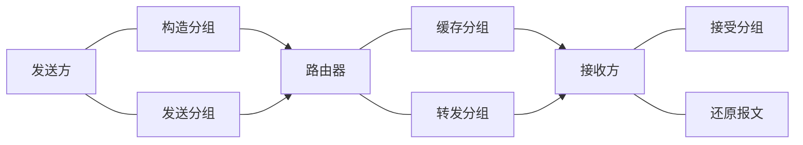
```mermaid
graph LR
    发送方 --- 构造分组
    发送方 --- 发送分组
    构造分组 --> 路由器
    发送分组 --> 路由器
    路由器 --- 缓存分组
    路由器 --- 转发分组
    缓存分组 --> 接收方
    转发分组 --> 接收方
    接收方 --- 接受分组
    接收方 --- 还原报文
```


| 优点                                                         | 缺点                                                         |
| :----------------------------------------------------------- | :----------------------------------------------------------- |
| 没有建立连接和释放连接的过程。                               | 分组首部带来了额外的传输开销。                               |
| 分组传输过程中逐段占用通信链路，有较高的通信线路利用率。     | 交换节点存储转发分组会造成一定的时延。                       |
| 交换节点可以为每一个分组独立选择转发路由，使得网络有很好的生存性。 | 无法确保通信时端到端通信资源全部可用，在通信量较大时可能造成网络拥塞。 |
| 有利于差错控制，具有更好的灵活性                             | 分组可能会出现失序和丢失等问题                               |

#### 1.2.3. 报文交换

-   报文交换是分组交换的前身
-   方式：报文被整个地发送、整体接收完成后才能转发
-   缺点：引起转发时延、需要较大存储缓存空间

#### 1.2.4. 三种交换方式的对比


-   报文交换和分组交换都不需要建立连接，传送突发数据时可以**提高通信线路利用率**

### 1.3. 计算机网络的定义和分类

#### 1.3.1. 计算机网络的定义

-   没有精确和统一的定义 

##### 1.3.1.1. 早期的简单定义

​		**互联**、**自治**的**计算机集合**

##### 1.3.1.2. 现阶段的一个较好定义

​		计算机网络主要是由一些**通用的、可编程的硬件互连而成**的

-   这些硬件

    -   **并非专门用来实现某一特定目的（例如，传送数据或视频信号）**

    -   而是能够**用来传送多种不同类型的数据，** **并能支持广泛的和日益增长的应用。**

#### 1.3.2. 计算机网络的分类

##### 1.3.2.1. 交换方式

​		电路交换、报文交换、分组交换

##### 1.3.2.2. 使用者

​		公用网（因特网）、专用网（军队、铁路、电力、银行）

##### 1.3.2.3. 传输介质

​		有线网络、无线网络

##### 1.3.2.4. 覆盖范围

​		WAN、MAN、LAN、PAN

##### 1.3.2.5. 拓扑结构

​		总线形、星形、环形、网状形

### 1.4. 计算机网络的性能指标

#### 1.4.1. 速率

数据的传输速率，也称数据率/比特率


#### 1.4.2. 带宽


**数据传送速率 =  min [主机接口速率，线路带宽，交换机或路由器的接口速率]** 

#### 1.4.3. 吞吐量

单位时间内通过某个网络或接口的实际数据量
- 常被用于对实际网络的测量，以便获知到底有多少数据量通过了网络。
- 受网络带宽的限制


#### 1.4.4. 时延
指数据从网络的一端传送到另一端所耗费的时间，也称为延迟或迟延。
- 数据构成：一个或多个 分组、甚至是一个比特
##### 1.4.4.1. 发送时延
$$
发送时延 = \frac{分组长度(b)}{发送速率(b/s)}
$$

$$
发送速率 = min [ 主机接口速率，线路带宽，交换机或路由器的接口速率 ] \\ or \ \ \ \ \ \   min [ 发送速率，链路带宽，接收速率 ]
$$

##### 1.4.4.2. 传播时延

$$
传播时延 = \frac{信道长度(m)}{信号传播速率(m/s)}
$$

|   介质   |       速率       |
| :------: | :--------------: |
| 自由空间 | 3.0 × $10^8$ m/s |
|  铜 线   | 2.3 × $10^8$ m/s |
|  光 纤   | 2.0 × $10^8$ m/s |

##### 1.4.4.3. 排队时延

​		不方便计算、不考虑

##### 1.4.4.4. 处理时延

​		不方便计算、不考虑


#### 1.4.5. 时延带宽积

传播时延和带宽的乘积，也称为以比特为单位的链路长度


#### 1.4.6. 往返时间（RTT）
指从发送端发送数据分组开始，到发送端收到接收端发 来的相应确认分组为止，总共耗费的时间。

#### 1.4.7. 利用率
##### 1.4.7.1. 链路利用率
指某条链路有百分之 几的时间是被利用的（即有数据通过）。
- 当某链路的利用率增大时，该链路引起的时延就会迅速增加。
##### 1.4.7.2. 网络利用率
指网络中所有链路的 链路利用率的加权平均。
- 在网络通信量不断增大时，分组在交换节点 （路由器或交换机）中的排队时延会随之增大，因此网络引起的时延就会增大。


#### 1.4.8. 丢包率
是指在一定的时间范围内，传输过程中**丢失的分组数量与总分组数量的比率**。
- 分类：接口丢包率、结点丢包率、链路丢包率、路径丢包率、网络丢包率
- 分组丢失主要有以下两种情况：
	- 分组在传输过程中出现**误码**，被传输路径中的**节点交换机**（例如路由器）或**目的主机**检测出误码而**丢弃**。
	- 节点交换机根据**丢弃策略**主动丢弃分组。
### 1.5. 计算机网络的体系结构

#### 1.5.1. 常见的三种计算机网络体系结构

​		OSI参考模型、TCP/IP参考模型、原理参考模型


#### 1.5.2. 分层的必要性

- 计算机网络是个非常复杂的系统
- “分层”可将庞大复杂的问题转化为若干较小的局部问题


##### 1.5.2.1. 物理层
- 解决使用何种信号来表示比特0和1的问题
    - 采用什么传输媒体（介质）
    - 采用什么物理接口
    - 采用什么信号表示比特0和1

##### 1.5.2.2. 数据链路层
- 解决数据包在一个网络或一段链路上传输的问题
    - 标识网络中各主机（主机编址，例如MAC地址）
    - 从比特流中区分出地址和数据（数据封装格式）
    - 协调各主机争用总线（媒体接入控制）
    - 以太网交换机的实现（自学习和转发帧）
    - 检测数据是否误码（差错检测）
    - 出现传输差错如何处理（可靠传输和不可靠传输）
    - 接收方控制发送方注入网络的数据量（流量控制）

##### 1.5.2.3. 网络层
- 解决数据包在多个网络之间传输和路由的问题
	- 标识网络和网络中的各主机（网络和主机共同编址，例如IP地址）
	- 路由器转发分组（路由选择协议、路由表和转发表）

##### 1.5.2.4. 运输层
- 解决进程之间基于网络的通信问题
	- 进程之间基于网络的通信（进程的标识，例如端口号）
	- 出现传输差错如何处理（可靠传输和不可靠传输）

##### 1.5.2.5. 应用层
- 解决通过应用进程的交互来实现特定网络应用的问题
	- 通过应用进程间的交互来完成特定的网络应用
	- 进行会话管理和数据表示

#### 1.5.3. 分层思想举例


#### 1.5.4. 专用术语

##### 1.5.4.1. 实体
指任何可发送或接收信息的硬件或软件进程
###### 1.5.4.1.1. 对等实体
指通信双方相同层次中的实体。


##### 1.5.4.2. 协议
是控制两个对等实体在**“水平方向”** 进行“**逻辑通信**”的**规则**的集合。
- 三要素
	- 语法：定义所交换信息的格式
	- 语义：定义通信双方所要完成的操作
	- 同步：定义通信双方的时序关系

##### 1.5.4.3. 服务
- 在协议的控制下，两个对等实体在水平方向的逻辑通信使得本层能够向上一层提供服务。
- 要实现本层协议，还需要使用下面一层所提供的服务
- 协议是“水平”的，而服务是“垂直”的。 
- 实体看得见下层提供的服务，但并不知道实现该服务的具体协议。
- 下层的协议对上层的实体是“透明”的。
- 服务访问点SAP
  - 在同一系统中相邻两层的实体交换信息的逻辑接口，用于区分不同的服务类型。
  - 帧的“类型”字段、IP数据报的“协议”字段，TCP报文段或UDP用户数据报的“端口号”字段都是SAP。
- 服务原语
  - 上层要使用下层所提供的服务时通过与下层交换的一些命令
- 协议数据单元（Protocol Data Unit，PDU）
  - **对等层次之间**传送的数据包
- 服务数据单元（Service Data Unit，SDU）
  - 同一系统内**层与层**之间交换的数据包


### 1.6. 题目

#### 1.6.1. 体系结构相关

##### 1.6.1.1. 【2009 33】补充：OSI表示层与会话层的功能、数据链路层、网络层、运输层作用范围


##### 1.6.1.2. 【2010 33】网络体系结构描述的内容


##### 1.6.1.3. 【2011 33】TCP/IP参考模型的网路层提供无连接不可靠的数据报服务


##### 1.6.1.4. 【2012 33】TCP/IP体系结构中 IP直接为ICMP提供服务


##### 1.6.1.5. 【2013 33】各层的功能


##### 1.6.1.6. 【2014 33】传输层为会话层提供服务


##### 1.6.1.7. 【2015 33】POP3协议


##### 1.6.1.8. 【2016 33】R1、Switch、Hub


##### 1.6.1.9. 【2017 33】传输效率


##### 1.6.1.10. 【2018 33】DNS可以使用传输层无连接服务


##### 1.6.1.11. 练习


#### 1.6.2. 时延相关

##### 1.6.2.1. 【1】


##### 1.6.2.2. 【2】


###### 1.6.2.2.1. **一般结论**


##### 1.6.2.3. 【3】解不等式


##### 1.6.2.4. 【4】


##### 1.6.2.5. 【5】【2013 35】


##### 1.6.2.6. 【6】【2010 34】


## 2. Physical layer

### 2.1. 物理层概述

#### 2.1.1. 物理层要实现的功能
- “透明”传输比特流
- 数据链路层只管“享受”物理层提供的比特流传输服务，不需知道其具体传输方法
#### 2.1.2. 物理层的接口特性
##### 2.1.2.1. 机械特性
- 形状和尺寸
- 引脚数目和排列
- 固定和锁定装置
##### 2.1.2.2. 电气特性
- 信号电压的范围
- 阻抗匹配的情况
- 传输速率
- 距离限制
##### 2.1.2.3. 功能特性
- 规定接口电缆的各条信号线的作用
##### 2.1.2.4. 过程特性
- 规定在信号线上传输比特流的一组操作过程，包括各信号间的时序关系
### 2.2. 物理层下面的传输媒体

#### 2.2.1. 传输媒体的分类
- 传输媒体是计算机网络设备之间的物理通路，也称为传输介质或传输媒介
- 传输媒体并**不包含在计算机网络体系结构中**


#### 2.2.2. 导向型传输媒体
##### 2.2.2.1. 同轴电缆
- 价格较贵且布线不够灵活和方便
###### 2.2.2.1.1. 基带同轴电缆（50Ω）
- 用于数字传输，在早期局域网中广泛使用
###### 2.2.2.1.2. 宽带同轴电缆（75Ω）
- 用于模拟传输，目前主要用于有线电视的入户线。
##### 2.2.2.2. 双绞线 
- 局域网领域基本上都采用双绞线作为传输媒体

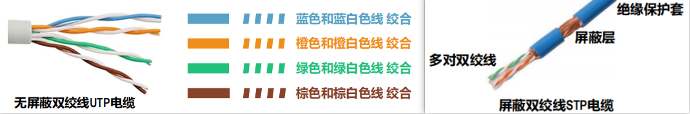

- 绞合的作用
	- 减少相邻导线间的电磁干扰
	- 抵御部分来自外界的电磁干扰
##### 2.2.2.3. 光纤

- 光纤通信系统的传输带宽远大于目前其他各种传输媒体的带宽
- 优点
    - 通信容量非常大
    - 抗雷电和电磁干扰性能好
    - 传输损耗小，中继距离长
    - 无串音干扰，保密性好
    - 体积小，重量轻
- 缺点
    - 切割光纤需要较贵的专用设备
	- 目前光电接口还比较昂贵

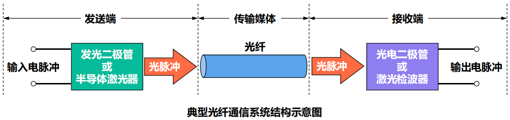

###### 2.2.2.3.1. 多模光纤


- 多条光波在多模光纤中不断地全反射
- 只适合于建筑物内的近距离传输

###### 2.2.2.3.2. 单模光纤


- 光在单模光纤中一直向前传播
- 适合长距离传输且衰减更小

#### 2.2.3. 非导向型传输媒体

##### 2.2.3.1. 无线电波

###### 2.2.3.1.1. 中低频

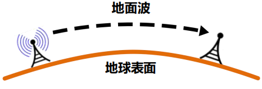

###### 2.2.3.1.2. 高频甚高频

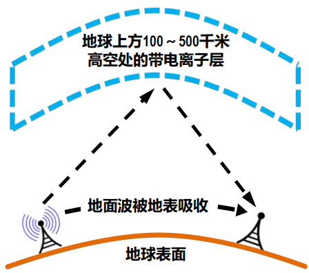

##### 2.2.3.2. 微波

###### 2.2.3.2.1. 地面微波接力通信

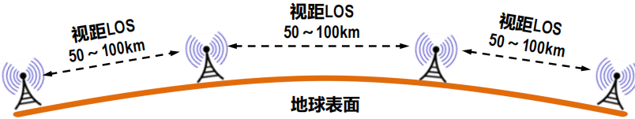

###### 2.2.3.2.2. 卫星通信

-   三颗同步卫星
-   中低轨道同步卫星

##### 2.2.3.3. 红外线

- 点对点无线传输
- 直线传输，中间不能有障碍物，传输距离短
- 传输速率低（4Mb/s ~ 16Mb/s）

##### 2.2.3.4. 激光

###### 2.2.3.4.1. 大气激光通信

- 优点
	- 通信容量大
	- 保密性强
	- 结构轻便
	- 设备经济
- 缺点
	- 通信距离受限于视距
	- 易受气候影响
	- 瞄准困难

###### 2.2.3.4.2. 光纤通信

##### 2.2.3.5. 可见光

- LIFI可见光通信

### 2.3. 传输方式

#### 2.3.1. 串行传输和并行传输

- 网卡同时具有串行传输和并行传输（并串转换、串并转换）

##### 2.3.1.1. 串行传输
- 用于远距离传输


##### 2.3.1.2. 并行传输
- 用于短距离传输
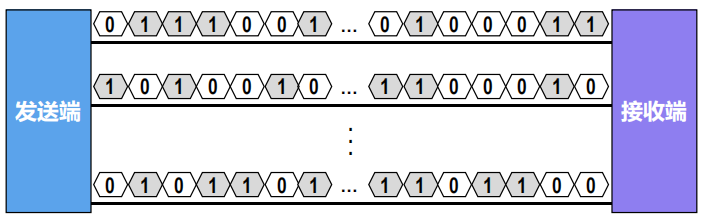

#### 2.3.2. 同步传输和异步传输

##### 2.3.2.1. 同步传输

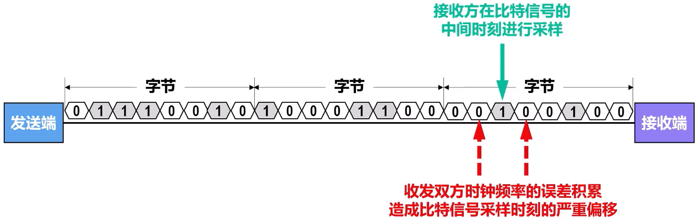

- 以**比特为传输单位**，字节之间没有间隔，也**没有起始位和终止位**。

- 收发双方时钟同步的方法
	- 外同步：在收发双方之间增加一条时钟信号线。
	- 内同步：发送端将时钟信号编码到发送数据中一起发送（例如曼彻斯特编码）。

##### 2.3.2.2. 异步传输


- 字节之间异步，即字节之间的时间间隔不固定。

-   以字节为传输单位。
-   接收端只在每个字节的起始处对字节内的比特实现同步。
-   要给每个字节添加起始位和结束位。

- 异步：指字节之间异步，即字节之间的时间间隔不固定。

- 字节中的每个比特仍然要同步，即各比特的持续时间是相同的。

#### 2.3.3. 单向通信、双向交替通信和双向同时通信

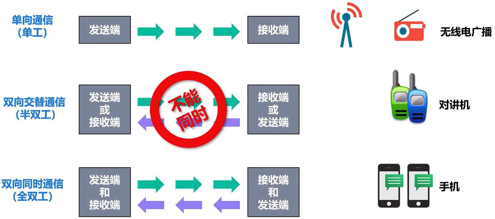

- 单向通信（单工）：无线电广播
- 双向交替通信（半双工）：不能同时、如对讲机
- 双向同时通信（全双工）：可同时、如手机

### 2.4. 编码与调制

#### 2.4.1. 编码与调制的基本概念


##### 2.4.1.1. 调制

- 基带调制（编码）：数字信道
	- 以太网采用的曼彻斯特编码、4B/5B、8B/10B
- 带通调制：模拟信道
	- Wi-Fi采用的CCK/DSSS/OFDM调制

##### 2.4.1.2. 码元
- 在使用时间域的波形表示信号时，代表不同离散数值的基本波形称为码元

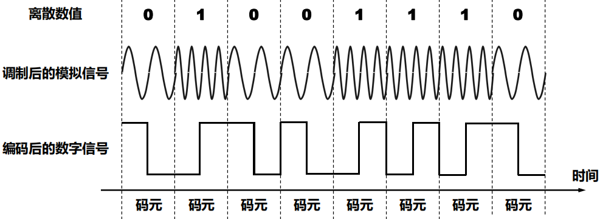

#### 2.4.2. 常用编码方式

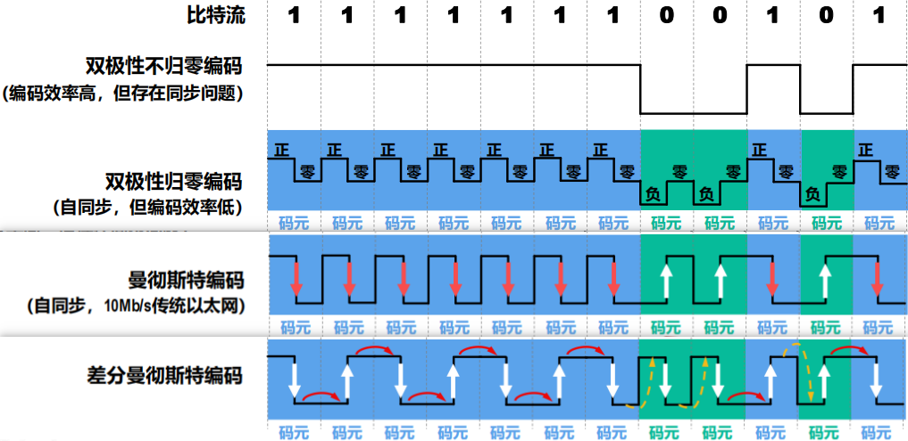

##### 2.4.2.1. 双极性不归零编码NRZ
- 编码效率高，但存在同步问题


##### 2.4.2.2. 双极性归零编码RZ
- 自同步，但编码效率低
- 码元中间时刻的电平跳变既表示时钟信号，也表示数据。 
- 正跳变表示1还是0，负跳变表示0还是1，可以自行定义。

##### 2.4.2.3. 曼彻斯特编码

-   正中间时刻发生电平跳变，既**表示时钟信号，也表示数据**。

- 自同步，10Mb/s传统以太网


##### 2.4.2.4. 差分曼彻斯特编码
- 码元中间时刻的电平跳变**仅表示时钟信号，而不表示数据**。
- **数据的表示在于每一个码元开始处是否有电平跳变**：无跳变表示1，**有跳变表示**0。
- 在噪声干扰环境下，**检测有无跳变比检测跳变方向更不容易出错**，因此差分曼彻斯特编码信号比曼彻斯特编码信号更易于检测。


#### 2.4.3. 基本的带通调制方法和混合调制方法

##### 2.4.3.1. 基本的带通调制方法

-   调幅（AM）、调频（FM）、调相（PM）

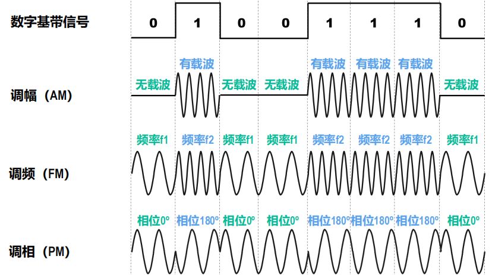

##### 2.4.3.2. 混合调制方法

- 频率和相位不能进行混合调制（频率是相位随时间的变化率）
- 通常情况下，载波的相位和振幅可以结合起来一起调制，例如**正交振幅调制QAM。**

###### 2.4.3.2.1. 正交振幅调制QAM-16

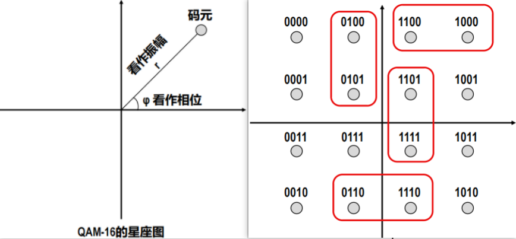

-   12种相位
-   每种相位有1或2种振幅可选
-   可以调制出16种码元（波形），每种码元可以对应表示4个比特（$log_216=4$）
-   每个码元与4个比特的对应关系采用格雷码，即任意两个相邻码元只有1个比特不同

### 2.5. 信道的极限容量

#### 2.5.1. 造成信号失真的主要因素

- 信道上传输的数字信号，可以看做是多个频率的模拟信号进行多次叠加后形成的方波。
- 码间串扰
	- 接收端接收到的信号波形失去了码元之间的清晰界限
	- 信道的频带越宽，则能够通过的信号的高频分量就越多，那么码元的传输速率就可以更高，而不会导致码间串扰。
- 信道的频率带宽是有上限的 --> 码元的传输速率也有上限

##### 2.5.1.1. 码元的传输速率
- 越高越严重

##### 2.5.1.2. 信号的传输距离
- 越远越严重

##### 2.5.1.3. 噪声干扰
- 越大越严重

##### 2.5.1.4. 传输媒体的质量
- 越差越严重

#### 2.5.2. 奈氏准则

$$
理想低通信道的最高码元传输速率 = 2 \textbf{W Baud} \\

\textbf{W}：信道的频率带宽（单位为Hz） \\

\textbf{Baud}：波特，即码元/秒 = 2 \ \textbf{W} \  码元/秒
$$

- 一个实际的信道所能传输的最高码元传输速率，要明显低于奈氏准则给出的上限值
- 码元传输速率又称为波特率、调制速率、波形速率或符号速率

#### 2.5.3. 香农公式

$$
C=Wlog_{2}(1+\frac{S}{N}) \\
$$

- 带宽受限且有高斯白噪声干扰的信道的极限信息传输速率

$$
C: 信道的极限信息传输速率（单位为b/s）\\
W: 信道的频率带宽（单位为Hz）\\
S: 信道内所传信号的平均功率\\ 
N: 信道内的高斯噪声功率\\
\frac{S}{N}: 信噪比，使用分贝（dB）作为度量单位\\
\ \ \ 信噪比(db)=10log_{10}(\frac{S}{N})(db)
$$


### 2.6. 信道复用技术

#### 2.6.1. 信道复用技术的基本原理

- 复用（Multiplexing）就是在一条传输媒体上同时传输多路用户的信号。
- 当一条传输媒体的传输容量大于多条信道传输的总容量时，就可以通过复用技术，在这条传输媒体上建立多条通信信道，以便充分利用传输媒体的带宽。


#### 2.6.2. 常见的信道复用技术

##### 2.6.2.1. 频分复用FDM

- 频分复用的所有用户同时占用不同的频带资源并行通信

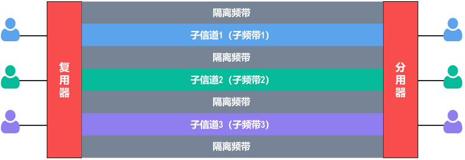

##### 2.6.2.2. 时分复用TDM

- 时分复用的所有用户在不同的时间占用同样的频带

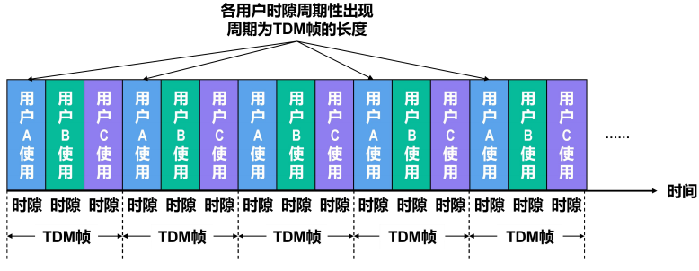

##### 2.6.2.3. 波分复用WDM

- 根据频分复用的设计思想，可在一根光纤上同时传输多个频率（波长）相近的光载波信号，实现基于光纤的频分复用技术。
- 目前可以在一根光纤上复用80路或更多路的光载波信号。因此，这种复用技术也称为密集波分复用DWDM。

##### 2.6.2.4. 码分复用CDM

- 码分复用（Code Division Multiplexing，CDM）常称为码分多址（Code Division Multiple Access，CDMA），它是在扩频通信技术的基础上发展起来的一种无线通信技术。
- 与FDM和TDM不同，CDMA的每个用户可以在相同的时间使用相同的频带进行通信。
- 码片（Chip）
  - CDMA将每个比特时间划分为m个更短的时间片
  - m的取值通常为64或128
- m比特码片序列（Chip Sequence）
  - 某个站要发送比特1，则发送它自己的m比特码片序列
  - 某个站要发送比特0，则发送它自己的m比特码片序列的反码
- 码片向量
  - 将码片序列中的比特0记为-1，而比特1记为+1
- 码片序列规则
  - 每个站的码片序列必须各不相同，实际常采用伪随机码序列。
  - 每个站的码片序列必须相互正交，即各码片序列相应的码片向量之间的规格化內积为0。

令向量A表示站A的码片向量，向量B表示站B的码片向量，则

$$
A \cdot B = \frac{1}{m} \sum_{i=1}^m A_{i}B{i} = 0
$$

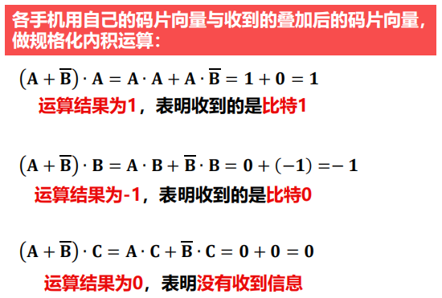

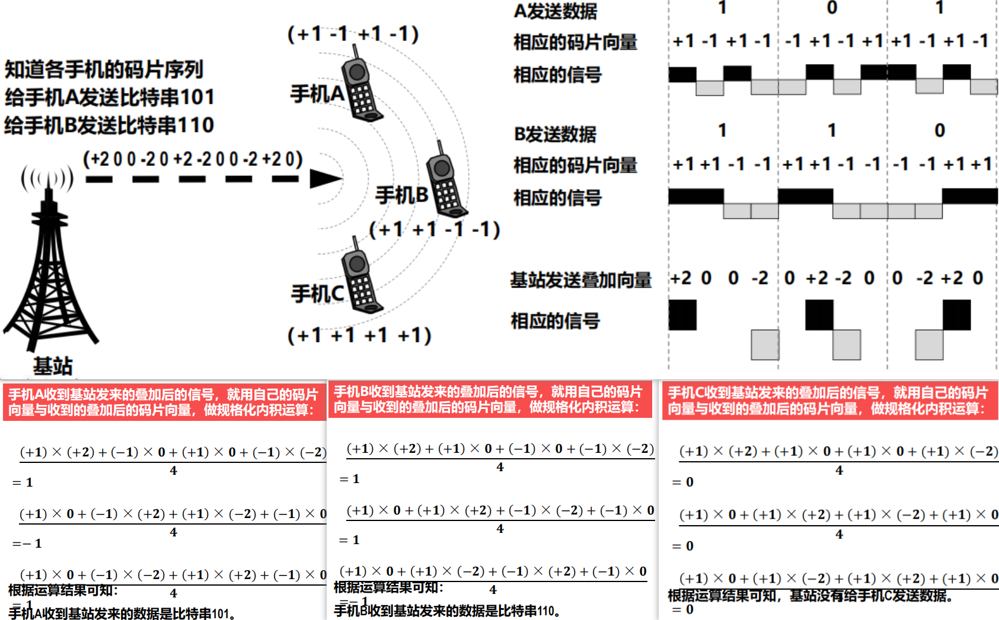

### 2.7. 题目

#### 物理层接口特性【2018 34】

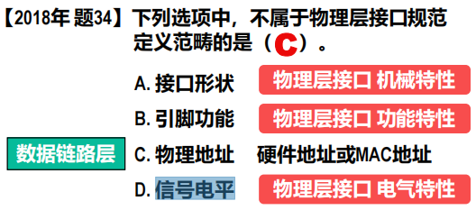

#### 曼彻斯特编码【2013 34】

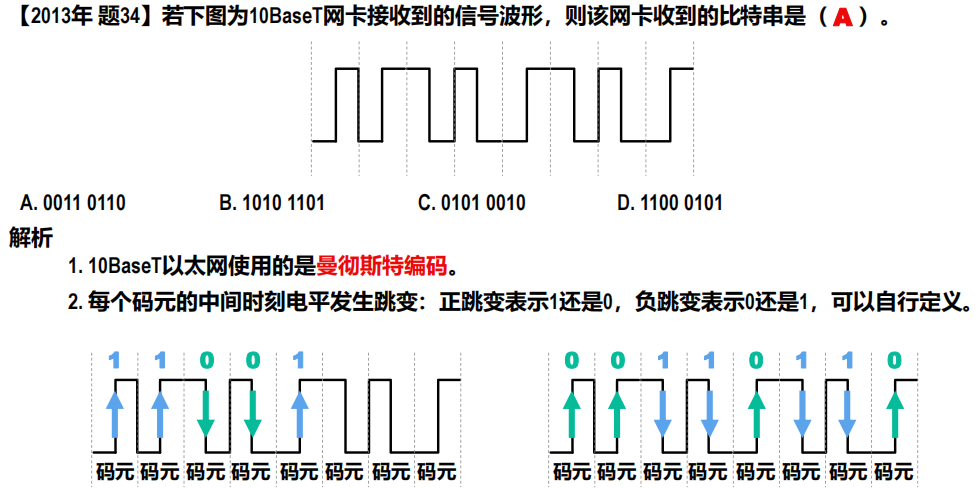

#### 差分曼彻斯特编码【2021 34】

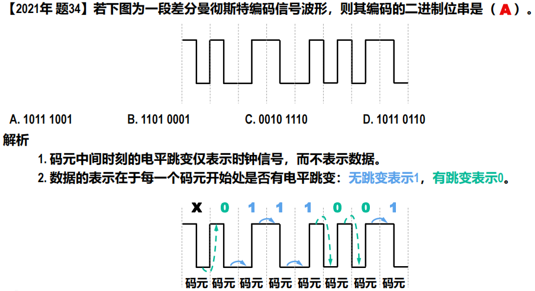


#### QAM调制

##### 【2009 34】


##### 【2011 34】

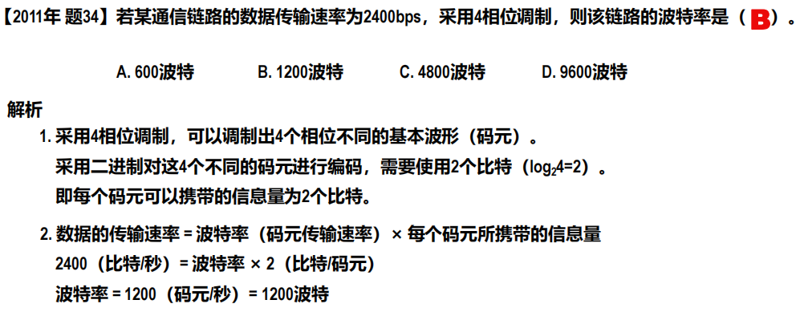

#### 数据传输速率影响因素【2014 35】


#### 香农公式&奈氏准则

##### 【2016 34】

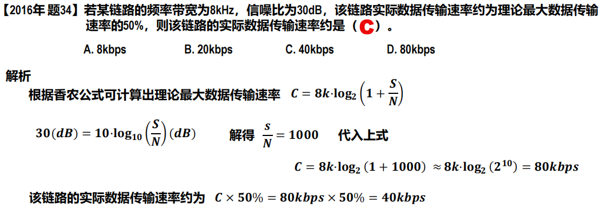

##### 【2017 34】

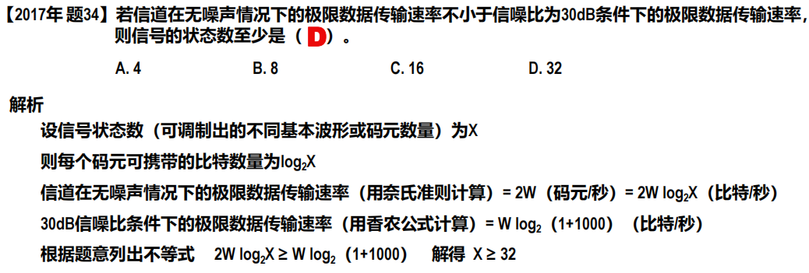

#### 码分复用

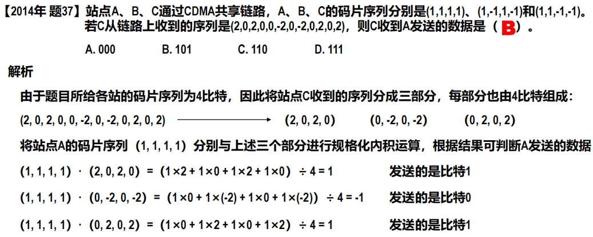

#### 编码方式

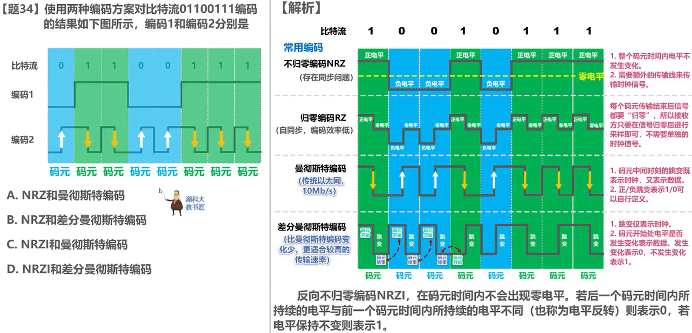

## 3. data link layer

### 3.1. 数据链路层概述

#### 3.1.1. 数据链路层在网络体系结构中所处的地位

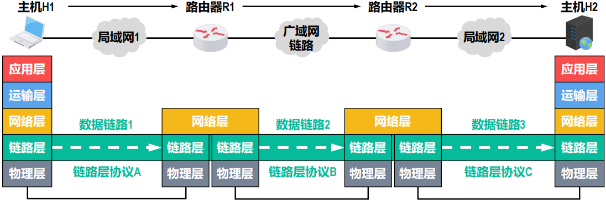


#### 3.1.2. 链路、数据链路和帧

##### 3.1.2.1. 链路（Link）
- 指从一个节点到**相邻节点**的一段物理线路（有线或无线），而**中间没有任何其他的交换节点。**

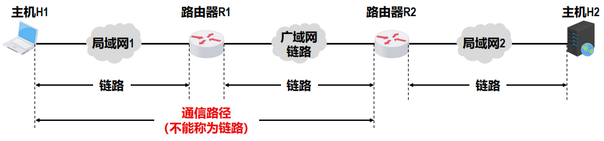

##### 3.1.2.2. 数据链路（Data Link）
- 数据链路是基于链路的。
- 当在一条链路上传送数据时，除需要链路本身，还需要一些**必要的通信协议**来控制这些数据的传输，把实现这些协议的硬件和软件加到链路上，就构成了数据链路。
- 计算机中的网络适配器（俗称**网卡**）和其相应的**软件驱动程序**就实现了这些协议。
- 一般的网络适配器都包含了物理层和数据链路层这两层的功能。


##### 3.1.2.3. 帧（Frame）
- 是数据链路层**对等实体之间**在水平方向进行逻辑通信的**协议数据单元PDU。**

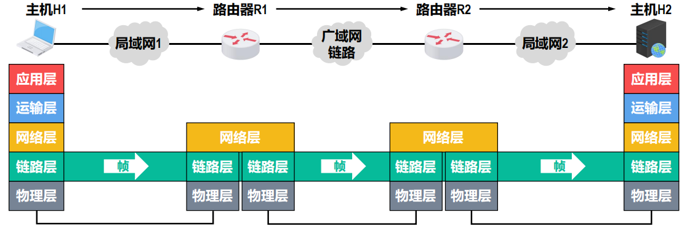

### 3.2. 数据链路层的三个重要问题

#### 3.2.1. 封装成帧和透明传输
##### 3.2.1.1. 封装成帧

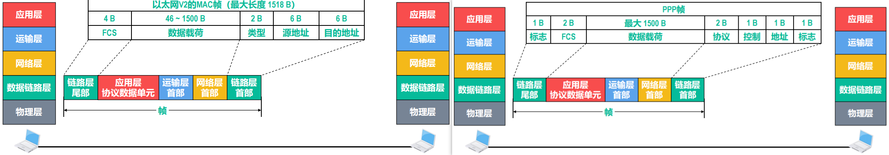

-   是指数据链路层给上层交付下来的协议数据单元PDU添加一个首部和一个尾部，使之成为帧。
	-   帧的首部和尾部中包含有一些重要的控制信息。
	-   帧首部和尾部的作用之一就是帧定界。
-   帧定界：接收端根据帧首部和帧尾部的标志字段，就可以从收到的比特流中识别出帧的开始和结束
-   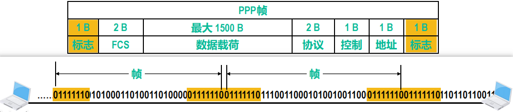
  - 并不是每一种数据链路层协议的帧都包含有帧定界标志。
      - 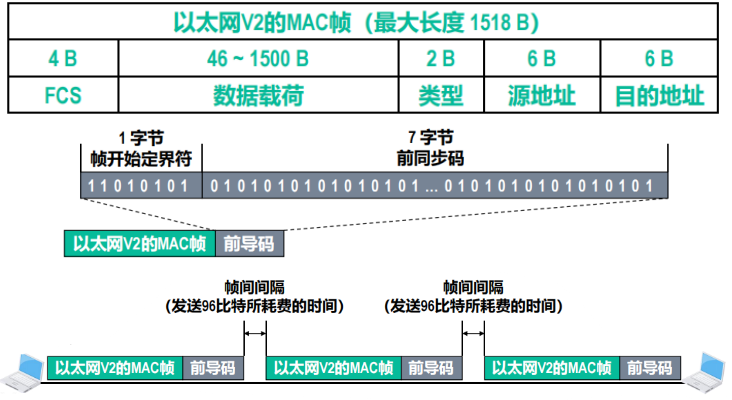

- 为了提高数据链路层传输帧的效率，应当使帧的数据载荷的长度尽可能地大于首部和尾部的长度。
-   考虑到对缓存空间的需求以及差错控制等诸多因素，每一种数据链路层协议都规定了帧的数据载荷的长度上限，即最大传送单元（Maximum Transfer Unit，MTU）。
  -   
  -   例如，以太网的MTU为1500个字节。


##### 3.2.1.2. 透明传输

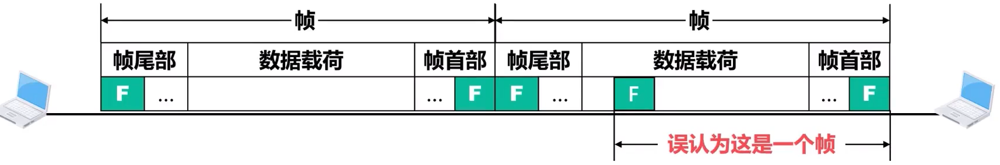

-   透明传输：数据链路层对上层交付下来的协议数据单元PDU没有任何限制，就好像数据链路层不存在 一样。

###### 3.2.1.2.1. 字节填充

- 插入转义字符、帧定界符


###### 3.2.1.2.2. 比特填充

-   如每遇到5个连续的比特1，就再其后面插入一个比特0（HDLC协议）

#### 3.2.2. 差错检测

#### 3.2.3. 误码的相关概念
- 比特差错
	- 比特在传输过程中：比特1可能变成比特0；比特0可能变成比特1。
- 误码率（Bit Error Rate，BER）：传输错误的比特数量占所传输比特总数的比率
	- 提高链路的信噪比，可以降低误码率。
	- 在实际的通信链路上，不可能使误码率下降为零。

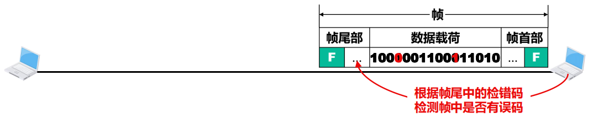

- 使用差错检测技术来检测数据在传输过程中是否产生了比特差错，是数据链路层所要解决的重要问题之一。
    - 帧在传输的过程中可能出现误码。
    - 接收方根据发送方添加在帧尾部中的检错码，可以检测出帧是否出现了误码。（采用与发送方相同的检错技术）
    - 帧检验序列（FCS）：帧尾部中用来存放检错码的字段


#### 3.2.4. 奇偶校验

- 奇校验是在待发送的数据后面**添加1个校验位**，使得添加该校验位后的整个数据中**比特1的个数为奇数。**
	- 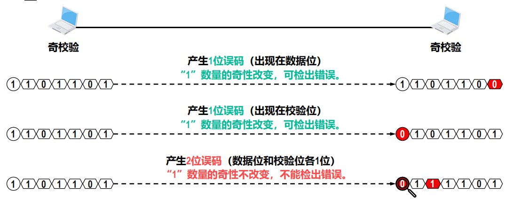
- 偶校验是在待发送的数据后面**添加1个校验位**，使得添加该校验位后的整个数据中**比特1的个数为偶数。**
    - 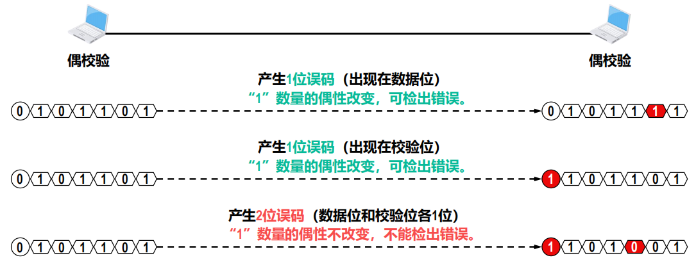


-   奇数误码可检出，偶数误码会漏检。
-   在实际使用时，奇偶校验又可分为垂直奇偶校验、水平奇偶校验以及水平垂直奇偶校验。

#### 3.2.5. 循环冗余校验

- 数据链路层广泛使用漏检率极低的循环冗余校验（Cyclic Redundancy Check，CRC）检错技术。

##### 3.2.5.1. CPC基本思想
- 收发双方约定好一个生成多项式G(X)。
- 发送方基于待发送的数据和生成多项式G(X)，计算出差错检测码（冗余码），将冗余码添加到待发送数据的后面一起传输。
- 接收方收到数据和冗余码后，通过生成多项式G(X)来计算收到的数据和冗余码是否产生了误码。


##### 3.2.5.2. 发送方CRC操作

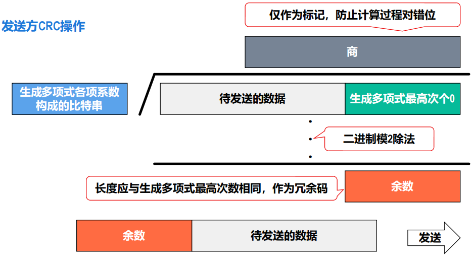

##### 3.2.5.3. 接收方CRC操作

- 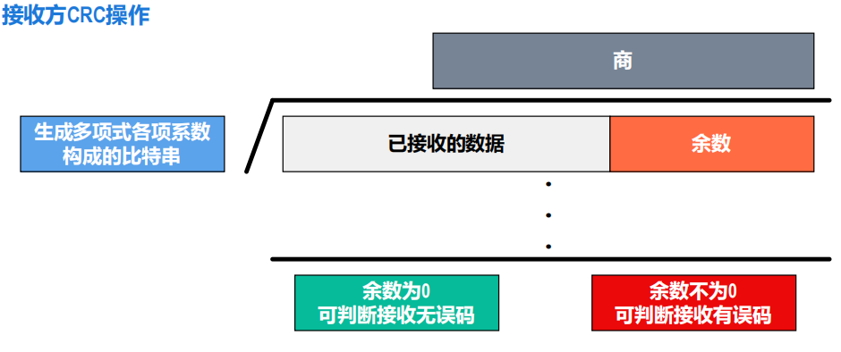


##### 3.2.5.4. 生成多项式

-   举例
	-   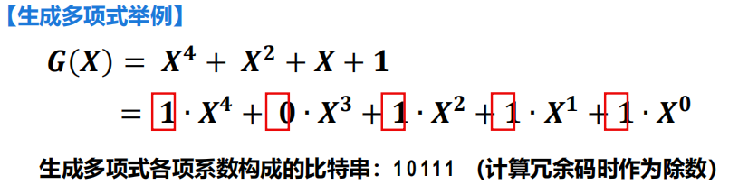

-   常用的生成多项式
	-   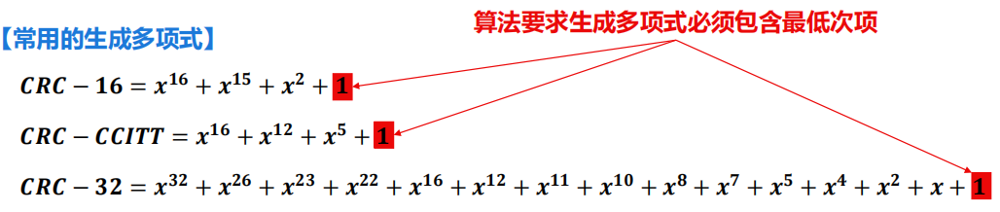

##### 3.2.5.5. CRC举例

-   发送方

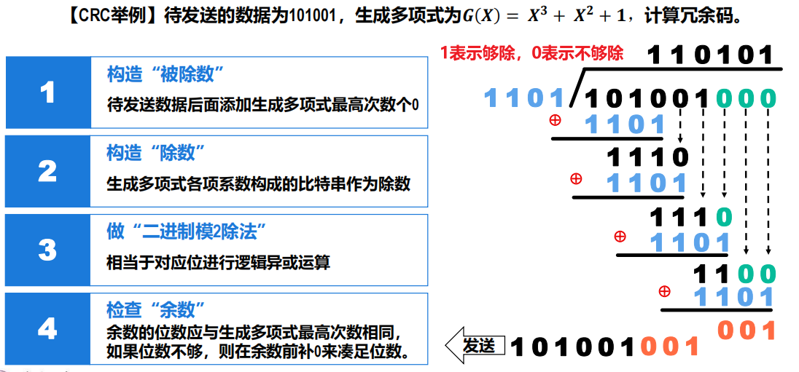

-   接收方


##### 3.2.5.6. 注意

-   奇偶校验、循环冗余校验等差错检测技术，只能检测出传输过程中出现了差错，但并**不能定位错误**，因此**无法纠正错误**。
-   要想纠正传输中的差错，可以使用冗余信息更多的**纠错码**（例如海明码）进行**前向纠错**。但纠错码的**开销比较大，在计算机网络中较少使用**。
-   在计算机网络中，通常采用我们后续课程中将要介绍的**检错重传方式来纠正传输中的差错**，**或者仅仅丢弃检测到差错的帧**，这取决于数据链路层向其上层提供的是可靠传输服务还是不可靠传输服务。
-   循环冗余校验CRC具有很好的检错能力（**漏检率极低**），虽然计算比较复杂，但非常**易于用硬件实现**，因此被广泛应用于数据链路层。

#### 3.2.6. 可靠传输

##### 3.2.6.1. 可靠传输的相关基本概念

###### 3.2.6.1.1. 不可靠传输
- 直接丢弃有误码的帧，其他什么也不做。
###### 3.2.6.1.2. 可靠传输
- 通过某种机制实现，实现发送方发送什么，接收方最终都能正确收到。

- 有线链路的误码率比较低，并不要求数据链路层向其上层提供可靠传输服务。
- 无线链路易受干扰，误码率比较高，因此要求数据链路层必须向其上层提供可靠传输服务。

###### 3.2.6.1.3. 传输差错
- 数据链路层及其下层
    - 误码（比特差错）
- 数据链路层的上层
    - 分组丢失
    - 分组失序
    - 分组重复


- 可靠传输服务并不局限于数据链路层，其他各层均可选择实现可靠传输。
- 可靠传输的实现比较复杂，开销比较大，是否使用可靠传输取决于应用需求。

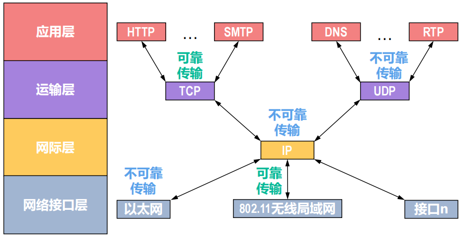

##### 3.2.6.2. 停止-等待协议（Stop-and-Wait，SW）

###### 3.2.6.2.1. 实现原理

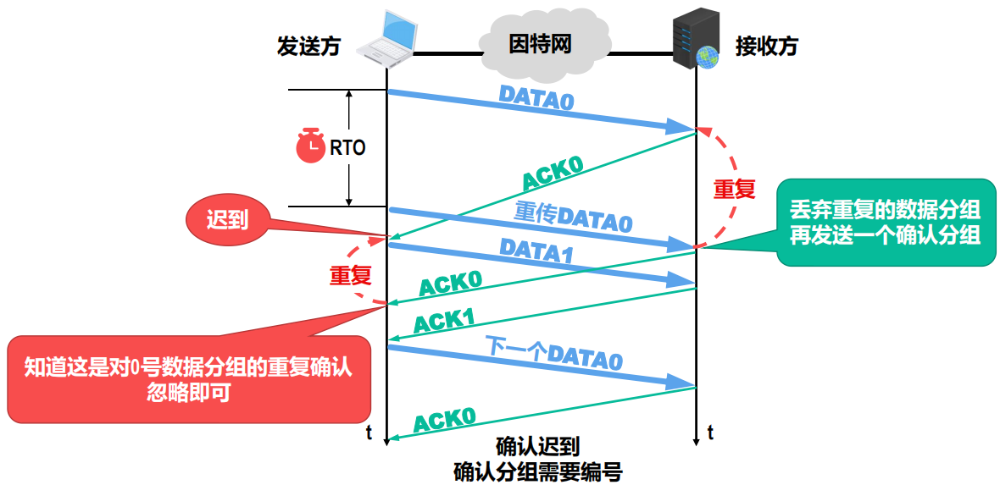

- 确认、否认和重传
- 超时重传
	- 使用超时重传机制后，就可以不使用否认机制了，这样可使协议实现起来更加简单。但是，如果点对点链路的误码率较高，使用否认机制可以使发送方在超时计时器超时前就尽快重传。
	- 超时重传时间（Retransmission Time-Out，RTO）：一般将RTO设置为略大于收发双方的平均往返时间RTT
		- 在数据链路层，点对点的往返时间RTT比较固定，RTO就比较好设定。
		- 在运输层，由于端到端往返时间非常不确定，设置合适的超时重传时间RTO有时并不容易。
- 分组编号（数据分组+确认分组）
	- 只需1个比特编序号即可，即序号0和序号1。
	- 数据链路层一般不会出现确认分组迟到的情况，因此在数据链路层实现停止-等待协议可以不用给确认分组编号。
- 停止-等待协议属于自动请求重传（Automatic Repeat reQuest，ARQ）协议。即重传的请求是发送方自动进行的，而不是接收方请求发送方重传某个误码的数据分组。

###### 3.2.6.2.2. 信道利用率

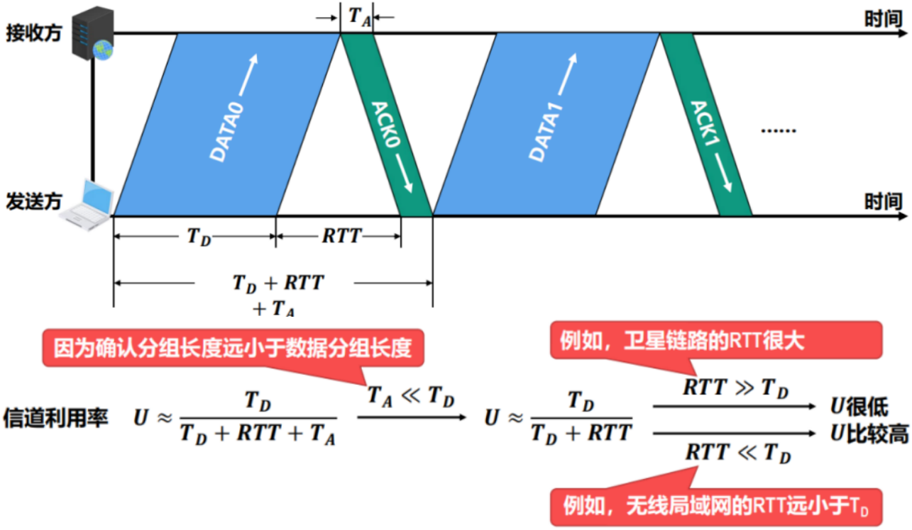

-   若出现超时重传，对于传送有用的数据信息来说，信道利用率还要降低。
-   在往返时间RTT相对较大的情况下，为了提高信道利用率，收发双方不适合采用停止-等待协议，而可以选择使用回退N帧（GBN）协议或选择重传（SR）协议。

##### 3.2.6.3. 回退N帧协议（Go-back-N，GBN）

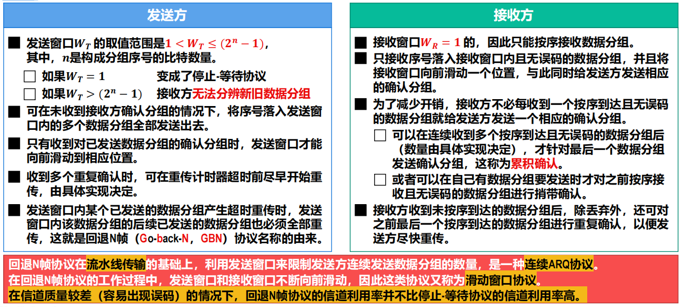

##### 3.2.6.4. 选择重传协议（Selective Repeat，SR）

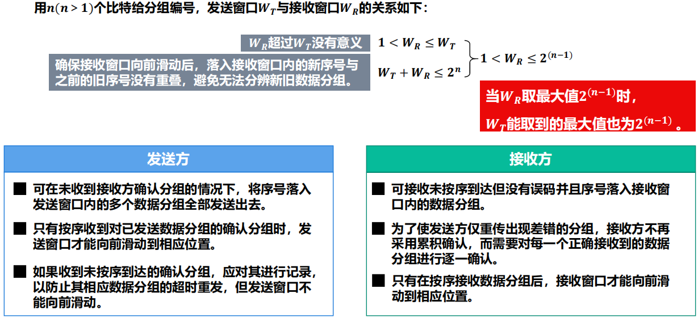

### 3.3. 点对点协议

#### 3.3.1. 点对点协议PPP概述
- 点对点协议（Point-to-Point Protocol，PPP）是目前使用最广泛的点对点数据链路层协议。
- 点对点协议PPP是因特网工程任务组（Internet Engineering Task Force，IETF）于1992年制定的。经过多次 修订，目前PPP已成为因特网的正式标准[RFC1661，RFC1662]。
- 应用
	- 用户接入因特网，用户计算机与ISP通信。
	- 广泛应用于广域网路由器之间的专用线路。
- 从网络体系结构的角度看点对点协议PPP的组成

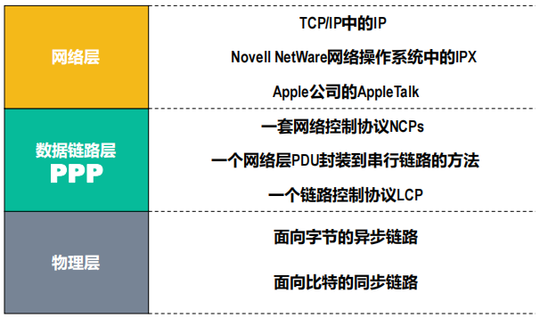

#### 3.3.2. PPP的帧格式

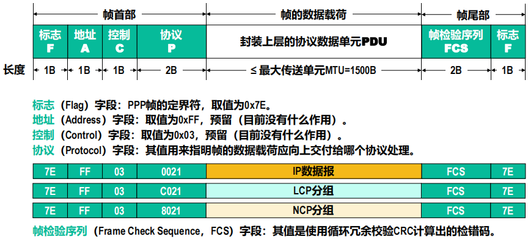

#### 3.3.3. PPP帧的透明传输

-   面向字节的异步链路使用字节填充来实现透明传输[RFC1662]

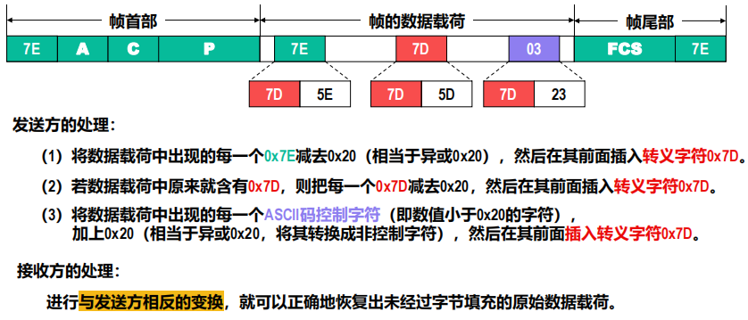


-   面向比特的同步链路使用零比特填充来实现透明传输

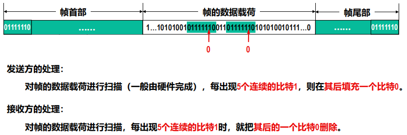

#### 3.3.4. PPP帧的差错检测

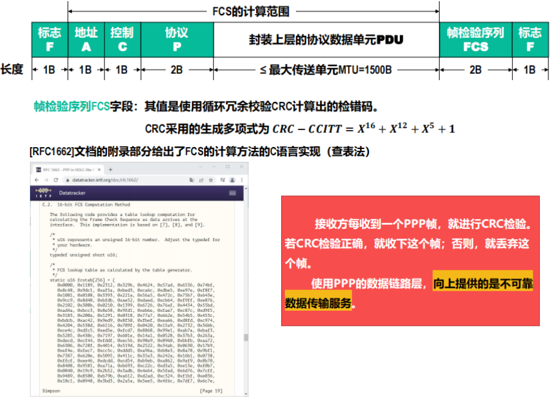

#### 3.3.5. PPP的工作状态

-   以用户主机拨号接入因特网服务提供者ISP的拨号服务器的过程为例


### 3.4. 共享式以太网
#### 3.4.1. 概述
- 以太网（Ethernet）以曾经被假想的电磁波传播介质——以太（Ether）来命名。
- 以太网最初采用无源电缆（不包含电源线）作为共享总线来传输帧，属于基带总线局域网，传输速率为2.94Mb/s。
- 发展
	- 1975 以太网诞生
	- 1976 以太网里程碑论文
	- 1979 3Com公司成立
	- 1980 以太网标准V1
	- 1982 以太网标准V2
	- 1983 IEEE以太网标准
- 以太网目前已经从传统的共享式以太网发展到交换式以太网，传输速率已经从10Mb/s提高到100Mb/s、1Gb/s甚至10Gb/s。

#### 3.4.2. 网络适配器和MAC地址

##### 3.4.2.1. 网络适配器

- **网络适配器**（Adapter）（一般简称为“网卡”）：将计算机连接到以太网。


-   在计算机内部，**网卡与CPU**之间的通信，一般是通过计算机主板上的I/O总线以**并行传输**方式进行
-   **网卡与外部以太网**（局域网）之间的通信，一般是通过传输媒体（同轴电缆、双绞线电缆、光纤）以**串行方式**进行的。
-   网卡除要**实现物理层和数据链路层功能**，其另外一个重要功能就是要进行**并行传输和串行传输的转换**。由于网络的传输速率和计算机内部总线上的传输速率并不相同，因此在网卡的核心芯片中都会包含**用于缓存数据的存储器**。
-   在确保网卡硬件正确的情况下，为了使网卡正常工作，还必须要在计算机的操作系统中为网卡安装相应的**设备驱动程序**。驱动程序**负责驱动网卡发送和接收帧**。

##### 3.4.2.2. MAC地址
###### 3.4.2.2.1. 概念
- 当多个主机连接在同一个广播信道上，要想实现两个主机之间的通信，则每个主机都必须有一个唯一的标识，即一个数据链路层地址。
-   MAC地址：用于媒体接入控制（Medium Access Control，MAC）；每个主机发送的帧的首部中，携带有发送主机（源主机）和接收主机（目的主机）的数据链路层地址。


-   MAC地址一般被固化在网卡的电可擦可编程只读存储器EEPROM中，因此MAC地址也被称为硬件地址。
-   MAC地址有时也被称为物理地址。

- 普通用户计算机中往往会包含两块网卡
	- 用于接入有线局域网的以太网卡
	- 用于接入无线局域网的Wi-Fi网卡
- 每块网卡都有一个全球唯一的MAC地址。
- MAC地址是对网络上各接口的唯一标识， 而不是对网络上各设备的唯一标识。

###### 3.4.2.2.2. IEEE 802局域网的MAC地址格式


###### 3.4.2.2.3. IEEE 802局域网的MAC地址发送顺序


###### 3.4.2.2.4. 单播MAC地址举例


###### 3.4.2.2.5. 广播MAC地址举例


###### 3.4.2.2.6. 多播MAC地址举例


- 网卡从网络上每收到一个帧，就检查帧首部中的目的MAC地址，按以下情况处理：
	- （1）如果目的MAC地址是广播地址（FF-FF-FF-FF-FF-FF），则接受该帧。
	- （2）如果目的MAC地址与网卡上固化的全球单播MAC地址相同，则接受该帧。
	- （3）如果目的MAC地址是网卡支持的多播地址，则接受该帧。
	- （4）除上述（1）、（2）和（3）情况外，丢弃该帧。
- 网卡还可被设置为一种特殊的工作方式：混杂方式（Promiscuous Mode）。工作在混杂方式的网卡，只要收到共享媒体上传来的帧就会收下，而不管帧的目的MAC地址是什么。
	- 对于网络维护和管理人员，这种方式可以监视和分析局域网上的流量，以便找出提高网络性能的具体措施。
	- 嗅探器（Sniffer）就是一种工作在混杂方式的网卡，再配合相应的工具软件（WireShark），就可以作为一种非常有用的网络工具来学习和分析网络。
	- 混杂方式就像一把“双刃剑”，黑客常利用这种方式非法获取网络用户的口令。

全球单播MAC地址就如同身份证上的身份证号码，具有唯一性，它往往与用户个人信息绑定在一起。因此，用户应尽量**确保自己拥有的全球单播MAC地址不被泄露**。

为了避免用户设备连接Wi-Fi热点时MAC地址泄露的安全问题，目前大多数移动设备都已经采用了
**随机MAC地址技术**。

#### 3.4.3. CSMA/CD协议

##### 3.4.3.1. CSMA/CD协议的基本原理

- 为了解决各站点争用总线的问题，共享总线以太网使用了一种专用协议CSMA/CD，它是载波监听多址接入/碰撞检测（Carrier Sense Multiple Access Collision Detection）的英文缩写词。


-   载波监听检测到总线空闲，但总线并不一定空闲。
-   使用CSMA/CD协议的共享总线以太网上的各站点，只是尽量避免碰撞并在出现碰撞时做出退避后重发的处理，但**不能完全避免碰撞**。
-   在使用CSMA/CD协议时，由于正在发送帧的站点必须“边发送帧边检测碰撞”，因此站点不可能同时进行发送和接收，也就是不可能进行全双工通信，而**只能进行半双工通信（双向交替通信）**。

###### 3.4.3.1.1. 多址接入 MA

- 多个站点连接在一条总线上，竞争使用总线。

###### 3.4.3.1.2. 载波监听 CS

- 每个站点在发送帧之前，先要检测一下总线上是否有其他站点在发送帧（“先听后说”）


###### 3.4.3.1.3. 碰撞检测CD

-   每个正在发送帧的站点边发送 边检测碰撞（“边说边听”）
	-   一旦冲突，立即停说，等待时机，重新再说


-   强化碰撞
	-   发送帧的站点一旦检测到碰撞，除了立即停止发送帧外，还要**再继续发送32比特或48比特的人为干扰信号（Jamming Signal）**，以便**有足够多的碰撞信号使所有站点都能检测出碰撞**。

##### 3.4.3.2. 共享式以太网的争用期

- 共享总线以太网的端到端往返时间**2τ被称为争用期（Contention Period）或碰撞窗口（Collision Window）**
- 站点从发送帧开始，最多经过时长2τ（即δ→ 0）就可检测出所发送的帧是否遭遇了碰撞。


- 从争用期的概念可以看出，共享总线以太网上的每一个站点从发送帧开始，到之后的一小段时间内，都有可能遭遇碰撞，而这一小段时间的长短是不确定的，它取决于另一个发送帧的站点与本站点的距离，但不会超过总线的端到端往返传播时延，即一个争用期2τ 。
	- 总线的长度越长（单程端到端传播时延越大），网络中站点数量越多，发生碰撞的概率就越大。
	- 共享以太网的总线长度不能太长，接入的站点数量也不能太多。

##### 3.4.3.3. 共享式以太网的最小帧长和最大帧长

-   最小帧长 = 数据传输速率 * 争用期 *2 τ*
    -   为了确保共享总线以太网上的每一个站点在发送完一个完整的帧之前，能够检测出是否产生了碰撞， 帧的发送时延就不能少于共享总线以太网端到端的往返时间，即一个争用期2τ 。
    -   对于10*mb/s*的共享总线以太网，其争用期2τ的值规定51.2*μs*，因此其最小帧长为512b，即64B。


-   最大帧长
    - 一般来说，帧的数据载荷的长度应远大于帧首部和尾部的总长度，这样可以提高帧的传输效率。

    
    - 然而，如果不限制数据载荷的长度上限，就可能使得帧的长度太长，这会带来一些问题。


##### 3.4.3.4. 共享式以太网的退避算法

-   在使用CSMA/CD协议的共享总线以太网中，正在发送帧的站点一边发送帧一边检测碰撞，当检测到碰撞时就立即停止发送，**退避一段随机时间**后再重新发送。

###### 3.4.3.4.1. 截断二进制指数退避
- 共享总线以太网中的各站点采用截断二进制指数退避（Truncated Binary Exponential Backoff）算法来选择退避的随机时间。


- 如果连续多次发送碰撞，就表明可能有较多的站点参与竞争信道。但使用上述退避算法**可使重传需要推迟的平均时间随重传次数而增大（即动态退避）**，因而**减小产生碰撞的概率。**
- **当重传达16次仍不能成功时**，就表明同时打算发送帧的站点太多，以至于连续产生碰撞，此时应**放弃重传**并向高层报告。

##### 3.4.3.5. 共享式以太网的信道利用率


#### 3.4.4. 使用集线器的共享式以太网

##### 3.4.4.1. 粗（->细）同轴电缆的共享总线以太网


- 若总线上的某个机械连接点接触不良或断开，则整个网络通信就不稳定或彻底断网。

##### 3.4.4.2. 集线器
- 集线器（Hub）：
	- 使用大规模集成电路来替代总线、并且可靠性非常高的设备。
	- 站点连接到集线器的传输媒体也转而使用更便宜、更灵活的双绞线电缆。


-   特点
    -   物理拓扑是星型的，但在逻辑上仍然是一个总线网。总线上的各站点共享总线资源，使用的还是CSMA/CD协议。
    -   只工作在物理层，仅简单地转发比特，并不进行碰撞检测。碰撞检测的任务由各站点中的网卡负责。
    -   有少量的容错能力和网络管理功能
	    -   例如，若网络中某个站点的网卡出现了故障而不停地发送帧，集线器可以检测到这个问题，在内部断开与出故障网卡的连线，使整个以太网能正常工作。

##### 3.4.4.3. 对比


##### 3.4.4.4. BASE-T星型以太网

- EEE于1990年制定了10BASE-T星型以太网的标准802.3i，这种以太网是局域网发展史上的一座非常重要的里程碑，它为以太网在局域网中的统治地位奠定了牢固的基础。
- 10BASE-T以太网的通信距离较短，每个站点到集线器的距离不能超过100m。
- IEEE 802.3以太网还可使用光纤作为传输媒体，相应的标准为10BASE-F，“F”表示光纤。光纤主要用作集线器之间的远程连接。


#### 3.4.5. 在物理层扩展以太网

##### 3.4.5.1. 扩展站点与集线器之间的距离

- 中两站点之间的距离太远会使传输的信号就会衰减到使CSMA/CD协议无法正常工作。
- 在早期广泛使用粗同轴电缆或细同轴电缆共享总线以太网时，为了提高网络的地理覆盖范围，常用的是工作在物理层的转发器。
- IEEE 802.3标准规定，两个网段可用一个转发器连接起来，任意两个站点之间最多可以经过三个网段。


- 在10BASE-T星型以太网中，可使用光纤和一对光纤调制解调器来扩展站点与集线器之间的距离。
	- 这种扩展方法比较简单，所需付出的代价是：为站点和集线器各增加一个用于电信号和光信号转换的光纤调制解调器，以及它们之间的一对通信光纤。

- 信号在光纤中的衰减和失真很小，因此使用这种方法可以很简单地将站点与集线器之间的距离扩展到1000以上。


-   在物理层扩展的共享式以太网仍然是一个碰撞域，不能连接太多的站点，否则可能会出现大量的碰撞，导致平均吞吐量太低。


##### 3.4.5.2. 扩展共享式以太网的覆盖范围和站点数量


#### 3.4.6. 在数据链路层扩展以太网

##### 3.4.6.1. 使用网桥在数据链路层扩展以太网

- 网桥（bridge）工作在数据链路层（包含其下的物理层），因此网桥具备属于数据链路层范畴的相关能力。
	- 网桥可以识别帧的结构。
	- 网桥可以根据帧首部中的目的MAC地址和网桥自身的帧转发表来转发或丢弃所收到的帧。


##### 3.4.6.2. 网桥的主要结构和基本工作原理


##### 3.4.6.3. 透明网桥的自学习和转发帧的流程

- 透明网桥（Transparent Bridge）通过自学习算法建立转发表。
	- “透明”，是指以太网中的各站点并不知道自己所发送的帧将会经过哪些网桥的转发，最终到达目的站点。也就是说，**以太网中的各网桥对于各站点而言是看不见的**。
	- 透明网桥的标准是IEEE 802.1D，它通过一种自学习算法**基于以太网中各站点间的相互通信**逐步建立起自己的转发表。


##### 3.4.6.4. 透明网桥的生成树协议STP

-   为了提高以太网的可靠性，有时需要在两个以太网之间使用多个透明网桥来提供冗余链路。
    -   在增加冗余链路提高以太网可靠性的同时，却给网络引入了环路。
    -   网络中的广播帧将在环路中永久兜圈，造成广播帧充斥整个网络，网络资源被白白浪费，而网络中的主机之间无法正常通信！
-   **生成树协议（Spanning Tree Protocol，STP）**
	-   避免广播帧在环路中永久兜圈；可以在增加冗余链路提高网络可靠性的同时，又避免环路带来的问题。
	-   不管网桥之间连接成了怎样复杂的带环拓扑，网桥之间通过**交互网桥协议单元（Bridge Protocol DataUnit，BPDU）**，**找出原网络拓扑的一个连通子集（即生成树）**，在这个子集里整个连通的网络中**不存在环路**。
	-   当首次连接网桥或网络拓扑发生变化时（人为改变或出现故障），网桥都会**重新构造生成树，以确保网络的连通**。


### 3.5. 交换式以太网

#### 3.5.1. 交换式以太网


#### 3.5.2. 以太网交换机

- 以太网交换机
	- 本质上就是一个多接口的网桥
	- 交换机自学习和转发帧的流程与网桥是相同的
	- 交换机也使用生成树协议STP，来产生能够连通全网但不产生环路的通信路径。
- 交换机的每个接口可以连接计算机，也可以连接集线器或另一个交换机。
	- 当交换机的接口与计算机或交换机连接时，可以工作在**全双工方式**，并能在**自身内部同时连通多对接口**，使每一对相互通信的计算机都能像独占传输媒体那样，无碰撞地传输数据，这样就**不需要使用CSMA/CD协议了**。
	- 当交换机的接口连接的是集线器时，该接口就只能使用CSMA/CD协议并只能工作在半双工方式。
	- 现在的交换机和计算机中的网卡都能自动识别上述两种情况，并自动切换到相应的工作方式。
	- 交换机一般都具有多种速率的接口，例如10Mb/s、100Mb/s、1Gb/s甚至10Gb/s的接口，大部分接口支持多速率自适应。


#### 3.5.3. 共享式以太网与交换式以太网的对比


-   集线器
    -   扩大了广播域
    -   扩大了碰撞域


-   交换机
    -   扩大了广播域
    -   隔离了碰撞域
-   交换式以太网的网络性能远高于共享式以太网，集线器早已被交换机取代。


### 3.6. 以太网的MAC帧格式  


#### 3.6.1. 以太网V2的MAC帧


- 接收方可能收到的无效MAC帧包括以下几种：
	- MAC帧的长度不是整数个字节
	- 通过MAC帧的FCS字段的值检测出帧有误码
	- MAC帧的长度不在64~1518字节之间
- **接收方收到无效的MAC帧时，就简单将其丢弃，以太网的数据链路层没有重传机制。**


### 3.7. 虚拟局域网

#### 3.7.1. 虚拟局域网VLAN的诞生背景

- 将多个站点通过一个或多个以太网交换机连接起来就构建出了交换式以太网。
- 交换式以太网中的所有站点都属于同一个广播域。
- 随着交换式以太网规模的扩大，广播域也相应扩大。


##### 3.7.1.1. 巨大的广播域会带来一系列问题
  - 广播风暴（广播风暴会浪费网络资源和各主机的CPU资源）
  - 难以管理和维护，带来潜在的安全问题。

##### 3.7.1.2. 分割广播域的方法


  - 使用路由器可以隔离广播域（成本较高）

  - 虚拟局域网技术应运而生


#### 3.7.2. 虚拟局域网VLAN概述

- 虚拟局域网（Virtual Local Area Network，VLAN）是一种将局域网内的站点划分成**与物理位置无关的逻辑组**的技术，一个逻辑组就是一个VLAN，VLAN中的各站点具有某些共同的应用需求。
- 属于同一VLAN的站点之间可以直接进行通信，而不同VLAN中的站点之间不能直接通信。
- 网络管理员可对局域网中的各交换机进行配置来建立多个逻辑上独立的VLAN
	- 连接在同一交换机上的多个站点可以属于不同的VLAN，而属于同一VLAN的多个站点可以连接在不同的交换机上。
- 虚拟局域网VLAN并不是一种新型网络，它只是局域网能够提供给用户的一种服务。

#### 3.7.3. 虚拟局域网VLAN的实现机制 —— IEEE 802.1Q帧

##### 3.7.3.1. IEEE 802.1Q帧

- 虚拟局域网VLAN有多种实现技术。
- 最常见的就是**基于以太网交换机的接口来实现VLAN**。
- 这就需要以太网交换机能够实现以下两个功能：
	- 能够处理带有VLAN标记的帧，也就是**IEEE 802.1Q帧**。
	- 交换机的各接口可以**支持不同的接口类型**，不同接口类型的接口对帧的处理方式有所不同。

- IEEE 802.1Q帧也称为Dot One Q帧，它对以太网V2的MAC帧格式进行了扩展：
	- 在源地址字段和类型字段之间插入了**4字节的VLAN标签**（tag）字段。
	- **最大长度为1522字节**


- 802.1Q帧一般不由用户主机处理，而是由以太网交换机来处理：
	- “打标签”：
		- 当交换机**收到普通的以太网MAC帧**时，会给其**插入4字节的VLAN标签使之成为802.1Q帧**。
	- “去标签
		- 当交换机转发802.1Q帧时，可能会**删除其4字节的VLAN标签使之成为普通的以太网MAC帧**。
			- 交换机转发802.1Q帧时也有可能不进行“去标签”处理，是否进行“去标签”处理取决于交换机的接口类型。

##### 3.7.3.2. 以太网交换机的接口类型

- 根据接口在**接收帧和发送帧时对帧的处理方式**的不同，以及**接口连接对象**的不同，以太网交换机的接口类型一般分为**Access和Trunk**两种。
- 当以太网交换机上电启动后，若之前未对其各接口进行过VLAN的相关设置，则各接口的接口类型默认为Access，并且各接口的缺省VLAN ID为1，即各接口默认属于VLAN1。
	- 对于思科交换机，接口的缺省VLAN ID称为本征VLAN（Native VLAN）。
	- 对于华为交换机，接口的缺省VLAN ID称为端口VLAN ID（Port VLAN ID），简记为PVID。
- 交换机的每个接口有且仅有一个PVID


### 3.8. 以太网的发展


#### 3.8.1. BASE-T以太网


#### 3.8.2. 吉比特以太网

##### 3.8.2.1. 简介


##### 3.8.2.2. 载波延伸


##### 3.8.2.3. 分组突发


##### 3.8.2.4. 物理层标准


#### 3.8.3. 吉比特以太网

##### 3.8.3.1. 简介


##### 3.8.3.2. 物理层标准


#### 3.8.4. 吉比特/100吉比特以太网

##### 3.8.4.1. 简介


### 3.9. 无线局域网

#### 3.9.1. 无线局域网的组成

- 随着移动通信技术的发展，**无线局域网（Wireless Local Area Network，WLAN）**自20世纪80年代末以来逐步进入市场。
- IEEE于1997年制定出了无线局域网的协议标准802.11，**802.11无线局域网**是目前应用最广泛的无线局域网之一，人们更多地将其简称为**Wi-Fi**（Wireless Fidelity，无线保真度）。
- 802.11无线局域网使用最多的是它的**固定基础设施的组网方式**。

##### 3.9.1.1. 无线局域网分类

###### 3.9.1.1.1. 有固定基础设施的

- 固定基础设施
	- 预先建立的
	- 能够覆盖一定地理范围的
	- 多个固定的通信基站


-   802.11标准并没有定义实现漫游的具体方法，仅定义了以下一些基本服务
	-  关联（Association）服务
		-  移动站与接入点AP建立关联的方法有以下两种：
			-  被动扫描
			
			
			
			-  主动扫描
			
			
	-   重建关联（Reassociation）服务和分离（Dissociation）服务
		-   如果一个移动站要把与某个接入点AP的关联转移到另一个AP，就可以使用重建关联服务；若要终止关联服务，就应使用分离服务。

###### 3.9.1.1.2. 无固定基础设施的

- 自组织网络（ad hoc Network）
    - 无基站或接入点AP
    - 是由一些对等的移动站点构成的临时网络
    - 数据在网络中被多跳存储转发
    - 转发站需要路由功能


#### 3.9.2. 无线局域网的物理层

##### 3.9.2.1. 概述

- 802.11无线局域网的物理层非常复杂，依据**工作频段、调制方式、传输速率**等，可将其分为多种物理层标准


- 802.11无线网卡一般会被做成多模的，以便能适应多种不同的物理层标准，例如支持802.11b/g/n。
- 无线局域网最初还使用**红外技术（infrared，IR）和跳频扩频（Frequency Hopping Spread Spectrum，FHSS）技术**，但目前已经很少使用了。
- 跳频技术的发明人，是好莱坞黄金时代的著名女星**海蒂·拉玛**，跳频技术为CDMA和Wi-Fi等无线通信技术奠定了基础。因此，海蒂·拉玛被誉为**“Wi-Fi之母”**。

##### 3.9.2.2. 近年新的物理层标准

- 最近几年，802.11无线局域网又有一些新的物理层标准陆续推出


#### 3.9.3. 无线局域网使用CSMA/CA协议的原因

##### 3.9.3.1. 区别
- 对于802.11无线局域网，其使用无线信道传输数据，这与共享总线以太网使用有线**传输介质不同**。因此，802.11无线局域网**不能简单照搬**共享总线以太网使用的**CSMA/CD协议**。
- 802.11无线局域网采用了另一种称为CSMA/CA的协议，也就是**载波监听多址接入/碰撞避免（Carrier Sense Multiple Access/Collision Avoidance，CSMA/CA）**。
- CSMA/CA协议仍然采用CSMA/CD协议中的CSMA，以**“先听后说”**的方式来减少碰撞的发生，但是将**“碰撞检测CD”改为了“碰撞避免CA”**。
	- 尽管CA表示碰撞避免，但并不能避免所有的碰撞，而是**尽量减少碰撞发生的概率**。

##### 3.9.3.2. 原因

- 由于**无线信道的传输环境复杂**且信号强度的动态范围非常大，在802.11无线网卡上**接收到的信号强度一般都远远小于发送信号的强度**，信号强度甚至相差百万倍。因此，**如果要在802.11无线网卡上实现碰撞检测，对硬件的要求非常高**。
- 即使能够在硬件上实现碰撞检测功能，但由于无线电波传播的特殊性（**存在隐蔽站问题**），还会**出现无法检测到碰撞的情况**，因此实现**碰撞检测并没有意义**。
	- 无线局域网的隐蔽站问题（Hidden Station Problem）


#### 3.9.4. CSMA/CA协议的基本工作原理


##### 3.9.4.1. DIFS

- DCF帧间间隔DIFS的长度为128μs，在DCF方式中，DIFS用来发送数据帧和管理帧。DCF是分布式协调功能（Distributed Coordination Function，DCF）的英文缩写词。在DCF方式下，没有中心控制站点，每个站点使用CSMA/CA协议通过争用信道来获取发送权。DCF方式是802.11定义的默认方式（必须实现）。
- 等待DIFS间隔是考虑到可能有其他的站有高优先级的帧要发送。

##### 3.9.4.2. 虚拟载波监听（Virtual Carrier Sense）机制
- 帧首部中的“持续时间”字段的值指出了源站要占用信道的时间（包括目的站发回确认帧所需的时间）
- 当某个站检测到正在信道中传送的帧首部中的“持续时间”字段时，就调整自己的网络分配向量（Network Allocation Vector，NAV）。NAV指出了完成这次帧的传送且信道转入空闲状态所需的时间。

##### 3.9.4.3. SIFS
- 短帧间间隔（Short Interframe Space，SIFS）的长度为28μs，它是最短的帧间间隔，用来分隔开属于一次对话的各帧。一个站点应当能够在这段时间内从发送方式切换到接收方式。使用SIFS的帧类型有ACK帧、CTS帧等。
- 由于无线信道的误码率较高，CSMA/CA协议还需要使用停止——等待的确认机制来实现可靠传输，这与使用CSMA/CD协议的共享式以太网不同。
- 当某个站在发送帧时，很可能有多个站都在监听信道并等待发送帧，一旦信道空闲，这些站几乎同时发送帧而产生碰撞。

##### 3.9.4.4. 退避算法

###### 3.9.4.4.1. 使用情况
- 为了避免上述情况，所有要发送帧的站检测到信道从忙转为空闲后，都要执行退避算法。这样不仅可以减少发生碰撞的概率，还可避免某个站长时间占用无线信道。
- 当某个站要发送数据帧时，仅在这种情况下才不使用退避算法：检测到信道空闲，并且该数据帧不是成功发送完上一个数据帧之后立即连续发送的数据帧。除此之外的以下情况，都必须使用退避算法：
  - 在发送帧之前检测到信道处于忙态
  - 在每一次重传一个帧时
  - 在每一次成功发送帧后要连续发送下一个帧时

###### 3.9.4.4.2. 算法内容


- 在执行退避算法时，站点为退避计时器设置一个随机的退避时间：
	- 当退避计时器的时间减小到零时，就开始发送数据；
	- 当退避计时器的时间还未减小到零时而信道又转变为忙状态，这时就**冻结**退避计时器的数值，重新等待信道变为空闲，再经过帧间间隔DIFS后，继续启动退避计时器。
- 在进行第i次退避时，退避时间在时隙编号{0，1，...，2^{2+i}-1}中随机选择一个，然后乘以基本退避时间（也就是一个时隙的长度）就可以得到随机的退避时间。当时隙编号达到255时（对应于第6次退避）就不再增加了。

###### 3.9.4.4.3. 对信道进行预约
- 为了进一步降低发生碰撞的概率，802.11无线局域网允许源站对信道进行预约。
- RTS（Request To Send）帧是短的控制帧
	- 包括源地址
	- 目的地址
	- 本次通信（包括目的站发回确认帧所需的时间）所需的持续时间。
- CTS（Clear To Send）帧是短的响应控制帧
	- 包括本次通信所需的持续时间（从RTS帧中将此持续时间复制到CTS帧中）。
- 除源站和目的站的其他各站，在收到CTS帧或数据帧后就**推迟访问信道**。这样就确保了源站和目的站之间的通信不会受到其他站的干扰
- 若RTS帧发生碰撞，源站就不可能收到CTS帧，源站会执行退避算法重传RTS帧。


#### 3.9.5. 无线局域网的MAC帧


### 3.10. 题目


#### 停止等待协议【2018 36】


#### 回退N帧协议

##### 【2009 35】


##### 【2014 36】


#### 选择重传协议【2011 35】


#### CDMA【2013 36】


#### 争用期【2010 47】


#### 最小帧长【2009 37】


#### 共享式以太网的信道利用率【2015 36】


#### 10BASET【2019 34】


#### 以太网交换机

##### 【2014 34】


##### 【2009 36】


##### 【2013 38】


#### 共享式以太网与交换式以太网的对比

##### 【2015 37】


##### 【2016 35】


##### 【2020 35】


#### 虚拟局域网VLAN的实现机制


#### CSMA/CA协议的基本工作原理

##### 【2011 36】


##### 【2018 35】


##### 【2020 37】


#### 802.11无线局域网的MAC帧【2017 35】


## 4. Network layer

### 4.1. 网络层概述

#### 4.1.1. 分组转发和路由选择

- 网络层的主要任务就是**将分组从源主机经过多个网络和多段链路传输到目的主机**，可以将该任务划分为组转发和路由选择两种重要的功能。


#### 4.1.2. 网络层向其上层提供的两种服务


##### 4.1.2.1. 面向连接的虚电路服务

- 核心思想是**“可靠通信应由网络自身来保证”**。
- 必须首先**建立网络层连接 —— 虚电路**（Virtual Circuit，VC），以保证通信双方所需的一切网络资源。
- 通信双方**沿着已建立的虚电路发送分组**。
- 通信结束后，需要**释放**之前所建立的虚电路。


-   这种通信方式如果再使用可靠传输的网络协议，就可使所发送的分组最终正确（无差错按序到达、不丢失、不重复）到达接收方。
-   很多广域分组交换网都使用面向连接的虚电路服务。例如，曾经的X.25和逐渐过时的帧中继（Frame Relay，FR）、异步传输模式（Asynchronnous Transfer Mode，ATM）。
-   然而，因特网的先驱者并没有采用这种设计思想，而是采用了无连接的数据报服务。

##### 4.1.2.2. 无连接的数据报服务

- 核心思想是**“可靠通信应由用户主机来保证”**。
- **不需要建立网络层连接。**
- **每个分组可走不同的路径**。 因此，每个分组的首部都必须携带目的主机的完整地址。
- 通信结束后，**没有需要释放的连接。**


-   这种通信方式所传送的分组可能误码、丢失、重复和失序。

### 4.2. 网际协议IP
- 网际协议（Internet Protocol，IP）是TCP/IP体系结构网际层中的核心协议。


#### 4.2.1. 异构网络互连


- 这些网络的拓扑、性能以及所使用的网络协议都不尽相同，这是由用户需求的多样性造成的，没有一种单一的网络能够适应所有用户的需求。
- 要将众多的异构型网络都互连起来，并且能够互相通信，则会面临许多需要解决的问题。
	- 不同的网络接入机制
	- 不同的差错恢复方法
	- 不同的路由选择技术
	- 不同的寻址方案
	- 不同的最大分组长度
	- 不同的服务（面向连接服务和无连接服务）

#### 4.2.2. IPv4地址及其编址方法


##### 4.2.2.1. 概述
- IPv4地址是给因特网（Internet）上的**每一个主机（或路由器）的每一个接口**分配的一个在全世界范围内**唯一的32比特的标识符**。


- IPv4地址的编址方法经历了三个历史阶段


##### 4.2.2.2. 表示方法：点分十进制

-   举例


-   练习


-   二进制转十进制


-   十进制转二进制


##### 4.2.2.3. 分类编制方法

-   IPv4分类编址方法不够灵活、容易造成大量IPv4地址资源浪费。


-   A类细节


-   B类细节


-   C类细节


-   **一般不使用的Ipv4地址**


-   练习


##### 4.2.2.4. 划分子网的编址方法

-   在主机号中借用几位比特作为子网号。
-   子网掩码：表明表明分类IPv4地址的主机号部分被借用了几个比特作为子网号。
	-   由32比特构成。
	-   用左起多个**连续的比特1**对应IPv4地址中的**网络号和子网号**。
	-   之后的多个**连续的比特0**对应IPv4地址中的**主机号**。
- 将划分子网的IPv4地址与相应的子网掩码进行**逐比特的逻辑与运算**，就可得到该IPv4地址所在子网的网络地址。


-   默认子网掩码
    -   指在未划分子网的情况下使用的子网掩码
    -   ABC类主机号全置为0


-   子网划分细节——练习


##### 4.2.2.5. 无分类编址方法

- 无分类编址方法使用的地址掩码与划分子网使用的子网掩码类似，由32比特构成。
	- 用左起多个**连续的比特1**对应IPv4地址中的**网络前缀**。
	- 之后的多个**连续的比特0**对应IPv4地址中的**主机号**。
- 用斜线记法标记网络前缀比特数。
    - **/30** 应用在*分配只有两个路由器接口的点对点链路。*【2019 47(2)】


- 无分类域间路由选择（Classless Inter-Domain Routing，CIDR ）
	- CIDR消除了传统A类、B类和C类地址以及划分子网的概念。
	- CIDR可以更加有效地分配IPv4地址资源，并且可以在IPv6使用之前允许因特网的规模继续增长。

- CIDR地址块：由将网络前缀都相同的、连续的多个无分类IPv4地址组成
	- 地址块中的最小地址
	- 地址块中的最大地址
	- 地址块中的地址数
	- 地址块中聚合某类网络（A类、B类、C类）的数量
	- 地址掩码

-   CIDR细节练习


- 使用无分类编址方法，可以根据客户的需要分配适当大小的CIDR地址块，因此可以更加有效地分配IPv4的地址空间。


- 使用无分类编址方法的另一个好处是路由聚合（也称为构造超网）。
    - 网络前缀越长，地址块越小，路由越具体。
    - 若路由器查表转发分组时发现有多条路由条目匹配，则选择网络前缀最长的那条路由条目，这称为最长前缀匹配，因为这样的路由更具体。


#### 4.2.3. IPv4地址的应用规划


##### 4.2.3.1. 定长子网掩码


##### 4.2.3.2. 变长子网掩码


- 在地址块中选取子块的原则
	- 每个子块的起点位置不能随便选取，只能选取主机号部分是块大小整数倍的地址作为起点。
	- **建议先为大的子块选取。**

#### 4.2.4. IPv4地址与MAC地址

##### 4.2.4.1. IPv4地址与MAC地址的封装位置


##### 4.2.4.2. 数据包传送过程中IPv4地址与MAC地址的变化情况


##### 4.2.4.3. IPv4地址与MAC地址的关系


#### 4.2.5. 地址解析协议ARP

- Address Resolution Protocol


#### 4.2.6. IP数据报的发送和转发流程

-   单播

    -   默认网关：路由器的IP地址

    -   将ip数据报中的目的地址与路由表中的地址掩码进行逻辑与运算找到下一跳


-   广播


##### 4.2.6.1. 主机发送IP数据报

- 判断目的主机是否与自己在同一个网络
	- 若在同一个网络，则属于**直接交付**
	- 若不在同一个网络，则属于**间接交付**。发送给主机所在网络的默认网关（路由器），由**默认网关帮忙转发**。

##### 4.2.6.2. 路由器转发IP数据报

- ① 检查收到的P数据报是否正确（生存时间是否结束；首部是否误码）
	- 若出错，则丢弃该P数据报并给发送该P数据报的源主机发送差错报告；
	- 若正确，则进行查表转发。
- ② 基于P数据报首部中的目的P地址在路由表中进行查找
	- 若找到匹配的路由条目，则按该路由条目的指示进行转发；
	- 若找不到匹配的路由条目，则丢弃该P数据报，并向发送该P数据报的源主机发送差错报告。
- ③ 查找步骤
  - 先根据路由表中目的地址的网络前缀，得出各目的地址的子网掩码。
  - 将子网掩码与所收到的IP数据包中的目的地址相与。
  - 若相与结果和**路由表中对应的目的地址**匹配，则选取网络前缀最长的那个目的地址进行转发。
  - 若相与结果不匹配任一目的地址，则选择默认路由0.0.0.0/0进行转发。

#### 4.2.7. IPv4数据报的首部格式

- IPv4数据报的首部格式及其内容是实现IPv4协议各种功能的基础。
- 在TCP/IP标准中，各种数据格式常常以32比特（即4字节）为单位来描述。


- 固定部分是指每个IPv4数据报都必须要包含的部分。
- 某些IPv4数据报的首部，除了包含20字节的固定部分，还包含一些可选的字段来增加IPv4数据报的功能。
- IPv4数据报首部中的各字段或某些字段的组合，用来表达IPv4协议的相关功能。

##### 4.2.7.1. 版本

- **长度为4个比特**，用来表示IP协议的版本。
- 通信双方使用的IP协议的版本必须一致。目前广泛使用的IP协议的版本号为4（即IPv4）。


##### 4.2.7.2. 首部长度

- **长度为4个比特**，该字段的取值**以4字节为单位**，用来表示IPv4数据报的首部长度。
    - 最小取值为二进制的0101，即十进制的5，再乘以4字节单位，表示IPv4数据报首部只有20字节固定部分。
    - 最大取值为二进制的1111，即十进制的15，再乘以4字节单位，表示IPv4数据报首部包含20字节固定部分和最大40字节可变部分。

##### 4.2.7.3. 可选字段

- 长度从1字节到40字节不等，用来支持排错、测量以及安全措施等功能.
    - 虽然可选字段增加了IPv4数据报的功能，但这同时也使得IPv4数据报的首部长度成为可变的，这就增加了因特网中每一个路由器处理IPv4数据报的开销。
    - 实际上，可选字段很少被使用。

##### 4.2.7.4. 填充

- 用来确保IPv4数据报的首部长度是4字节的整数倍，使用全0进行填充。

##### 4.2.7.5. 区分服务

- 长度为8个比特，用来获得更好的服务。

##### 4.2.7.6. 总长度

- **长度为16个比特**，该字段的取值**以字节为单位**，用来表示IPv4数据报的长度（首部长度+数据载荷长度）。
- 最大取值为二进制的16个比特1，即十进制的65535（很少传输这么长的IPv4数据报）。

-   计算举例


##### 4.2.7.7. IP数据包分片


###### 4.2.7.7.1. 标识

- **长度为16个比特**，属于**同一个IPv4数据报的各分片数据报应该具有相同的标识**。
- IP软件会维持一个计数器，每产生一个IPv4数据报，计数器值就加1，并将此值赋给标识字段。

###### 4.2.7.7.2. 标志

- 最低位（More Fragment，MF）
	- MF=1表示本分片后面还有分片
	- MF=0表示本分片后面没有分片
- 中间位（Don't Fragment，DF）
	- DF=1表示不允许分片
	- DF=0表示允许分片
- 最高位为保留位，必须设置为0

###### 4.2.7.7.3. 片偏移

- 长度为13个比特，该字段的取值以8字节为单位。
- 作用：指出分片IPv4数据报的数据载荷偏移其在原IPv4数据报的位置有多远。
- 计算
    - 分片**第一个字节的序号**/8
    - 片偏移必须是整数，并且以8字节为单位，**若算出来小数，则需要调整分片长度为8的倍数**。【2021 36】


`计算举例`


##### 4.2.7.8. 生存时间（Time To Live，TTL）

- **长度为8个比特**，最大取值为二进制的11111111，即十进制的255。

- 该字段的取值最初以秒为单位。
	- 因此，IPv4数据报的最大生存时间最初为255秒。
	- 路由器转发IPv4数据报时，将其首部中该字段的值减去该数据报在路由器上所耗费的时间，若结果不为0就转发，否则就丢弃。

- 生存时间字段后来**改为以“跳数”为单位**
	- 路由器*收到待转发的IPv4数据报时，将其首部中的该字段的值减1*，若结果不为0就转发，否则就丢弃。
	
- 作用：**防止被错误路由的IPv4数据报无限制地在因特网中兜圈**。

    


##### 4.2.7.9. 协议

- **长度为8个比特**
- 作用：*指明IPv4数据报的数据载荷是何种协议数据单元PDU*。


##### 4.2.7.10. 首部检验和

- 长度为16个比特
- 作用：用于检测IPv4数据报在传输过程中其首部是否出现了差错。
- IPv4数据报每经过一个路由器，其首部中的某些字段的值（例如生存时间TTL、标志以及片偏移等）都可能发生变化，因此**路由器都要重新计算一下首部检验和。**

###### 4.2.7.10.1. 首部检验和的计算方法


-   由于网际层并不向其高层提供可靠传输的服务，并且计算首部检验和是一项耗时的操作，因此在IPv6中，路由器不再计算首部检验和，从而更快转发IP数据报。

##### 4.2.7.11. 源IP地址

- 长度为32个比特
- 作用：用来填写发送IPv4数据报的源主机的IPv4地址。

##### 4.2.7.12. 目的IP地址

- 长度为32个比特
- 用来填写接收IPv4数据报的目的主机的IPv4地址。

### 4.3. 静态路由配置

#### 4.3.1. 人工配置静态路由


#### 4.3.2. 默认路由0.0.0.0/0


-   默认路由条目中的目的网络0.0.0.0/0，其中0.0.0.0表示任意网络，而网络前缀“/0”（相应的地址掩码为0.0.0.0）是最短的网络前缀。
-   路由器在查找转发表转发IP数据报时，遵循**“最长前缀匹配”**的原则，因此**默认路由条目的匹配优先级最低**。
-   默认路由可以减少路由表所占用的存储空间和搜索路由表所耗费的时间。

#### 4.3.3. 特定主机路由/32

-   **特定主机路由条目的匹配优先级最高**。


-   特定主机路由条目中的目的网络192.168.2.1/32，其中192.168.2.1是特定主机的IP地址，而网络前缀“/32”（相应地址掩码为255.255.255.255）是最长的网络前缀。
-   图中，在查表转发去往192.168.2.1这台特定主机的IP数据报时，192.168.2.0/24和192.168.2.1/32两个路由条目都可以匹配，遵循“最长前缀匹配”的原则，**按照匹配优先级最高的特定主机路由条目进行转发**。

#### 4.3.4. 需注意的问题

-   进行静态路由配置需要认真考虑和谨慎操作，否则可能出现以下问题：
	-   路由条目配置错误，甚至导致出现**路由环路**。
	-   聚合路由条目时可能**引入不存在的网络**。

### 4.4. 因特网的路由选择协议

#### 4.4.1. 路由选择分类

##### 4.4.1.1. 静态路由选择

- 采用**人工配置**的方式给路由器添加网络路由、默认路由和特定主机路由等路由条目。
- 静态路由选择**简单、开销小**，但**不能及时适应网络状态（流量、拓扑等）的变化。**
- 静态路由选择一般只在**小规模网络**中采用。

##### 4.4.1.2. 动态路由选择

- 路由器通过路由选择协议**自动获取**路由信息。
- 动态路由选择**比较复杂、开销比较大**，但**能较好地适应网络状态的变化。**
- 动态路由选择适用于**大规模网络**。

#### 4.4.2. 因特网采用分层次的路由选择协议

##### 4.4.2.1. 特点


##### 4.4.2.2. 举例


#### 4.4.3. 路由信息协议RIP（封装在UDP）

##### 4.4.3.1. 基本概念

-   路由信息协议（Routing Information Protocol，RIP）是内部网关协议中最先得到广泛使用的协议之一，其相关标准文档为[RFC 1058]。
-   距离向量（Distance-Vector，D-V）：RIP要求自治系统AS内的每一个路由器，都要维护从它自己到AS内其他每一个网络的距离记录。这组距离称为距离向量。
-   跳数（Hop Count）：度量（Metric）来衡量到达目的网络的距离
	-   将路由器**到直连网络的距离定义为1**。
	-   将路由器**到非直连网络的距离定义为所经过的路由器数加1**。
	-   允许一条路径最多只能包含15个路由器，**距离等于16时相当于不可达**。因此RIP**只适用于小型互联网**。


-   好的路由：距离短，即**所通过路由器数量最少的路由**。
	-   如下图，RIP认为R1到R5的好路由是：R1→R4→R5


-   等价负载均衡：当到达同一目的网络有多条RIP距离相等的路由时，可以进行等价负载均衡，也就是将通信量均衡地分布到多条等价的路径上。


-   特点
    -   和谁交换信息
	    -   仅和**相邻路由器**交换信息。
    -   交换什么信息
	    -   路由器自己的**路由表**。
	    -   即本路由器到所在自治系统AS中各网络的最短RIP距离，以及到各网络应经过的下一跳路由器。
    -   何时交换信息
	    -   **周期性交换**（例如，每个约30秒）。
	    -   为了加快RIP的收敛速度，当网络拓扑发生变化时，路由器要及时向相邻路由器通告拓扑变化后的路由信息，这称为**触发更新**。

##### 4.4.3.2. 基本工作过程


-   路由器刚开始工作时，只知道自己到直连网络的RIP距离为1。
-   每个路由器仅和相邻路由器周期性地交换并更新路由信息。
-   收敛：若干次交换和更新后，每个路由器都知道到达本自治系统AS内各网络的最短距离和下一跳路由器。

##### 4.4.3.3. 距离向量算法


-   D不需要关心C中下一跳的内容，收到后将C中的下一条均改为C。

-   从D修改后路由器C的路由表的目的网络往下看
    
    -   N2：到达目的网络，相同的下一跳，表示信息为最新，要更新D中N2的RIP距离
    -   N3：发现新的网络，向D的路由表中添加。
    -   N6：到达目的网络，不同的下一条（F、C），新路由RIP更短（有优势），要更新D中N6的RIP距离
    -   N8：到达目的网络，不同的下一条，RIP距离相等，可以等价负载均衡，向D的路由表中添加。
    -   N9：到达目的网络，不同的下一条（F、C），新路由RIP更长（处于劣势），不更新更新D中N9的RIP距离
    
-   更新后D的路由表如下


-   除了上述RIP路由条目更新规则，在RIP的距离向量算法中还包含以下一些**时间参数**：
    -   路由器每隔大约30秒向其所有相邻路由器发送路由更新报文。
    -   若180秒（默认）没有收到某条路由条目的更新报文，则把该路由条目标**记为无效（即把RIP距离设置为16，表示不可达）**。
    -   若再过一段时间（如120秒），还没有收到该路由条目的更新报文，则将该路由条目从路由表中删除。

##### 4.4.3.4. 存在的问题——“坏消息传播得慢”


##### 4.4.3.5. 版本和相关报文的封装


##### 4.4.3.6. 优缺点


#### 4.4.4. 开放最短路径优先OSPF（封装在IP）

##### 4.4.4.1. 基本概念

- 开放最短路径优先（Open Shortest Path First，OSPF）协议是为了**克服路由信息协议RIP的缺点**在1989年开发出来的。
	- “开放”表明OSPF协议不是受某一厂商控制，而是公开发表的。
	- “最短路径优先”是因为**使用了Dijkstra提出的最短路径算法**（Shortest Path First，SPF）。

- “开放最短路径优先”只是一个路由选择协议的名称，但这**并不表示其他的路由选择协议不是“最短路径优先”**。实际上，用于自治系统AS内部的各种路由选择协议（例如RIP），都要寻找一条“最短”的路径。

- OSPF是**基于链路状态**的，而不像RIP是基于距离向量的。
	- 链路状态（Link State，LS）是指本路由器都和哪些路由器相邻，以及相应链路的“代价（cost）”。
		- 	“代价”用来表示费用、距离、时延和带宽等，这些都由网络管理人员来决定。


- 优点
    - OSPF**基于链路状态**并采用最短路径算法计算路由，从算法上保证了不会产生路由环路。
    - OSPF**不限制网络规模，更新效率高，收敛速度快**。

-   OSPF路由器邻居关系的建立和维护
	-   OSPF相邻路由器之间通过交互问候（Hello）分组来建立和维护邻居关系。


- 链路状态通告


- 链路状态更新分组

-   链路状态数据库 


-   基于链路状态数据库进行最短路径优先计算


##### 4.4.4.2. 五种分组类型


##### 4.4.4.3. 基本工作过程


##### 4.4.4.4. 多点接入网络中的OSPF路由器


##### 4.4.4.5. OSPF划分区域

- 为了使OSPF协议能够**用于规模很大的网络**，OSPF**把一个自治系统AS再划分为若干个更小的范围**，称为**区域（area）**。
	- 每个区域的规模不应太大，一般所包含的路由器不应超过200个。
	- 划分区域的好处就是把利用洪泛法交换链路状态信息的范围局限于每一个区域，而不是整个自治系统AS，这样就减少了整个网络上的通信量。


-   自治系统边界路由器（AS Border Router，ASBR）：R6
-   主干路由器（Backbone Router，BBR）：R3、R4、R5、R6和R7
-   区域内路由器（Internal Router，IR）：区域1内的R1和R2，区域2内的R8，区域3内的R9
-   区域边界路由器（Area Border Router，ABR）：R3、R4和R7

#### 4.4.5. 边界网关协议BGP（封装在TCP）

##### 4.4.5.1. 基本概念

- 边界网关协议（Border Gateway Protocol，BGP）属于外部网关协议EGP这个类别，用于自治系统AS之间的路由选择协议。
	- 由于在不同AS内度量路由的“代价”（距离、带宽、费用等）可能不同，因此对于AS之间的路由选择，使用统一的“代价”作为度量来寻找最佳路由是不行的。
	- AS之间的路由选择还必须考虑相关策略（政治、经济、安全等）。
	- BGP只能是力求寻找一条能**够到达目的网络且比较好的路由**（即不能兜圈子），而**并非要寻找一条最佳路由。**


- BGP发言人
  - 在配置BGP时，每个AS的管理员要**选择至少一个路由器作为该AS的“BGP发言人”。**
  - 一般来说，两个BGP发言人都是通过一个共享网络连接在一起的，而**BGP发言人往往就是BGP边界路由器**。
  - 使用TCP连接交换路由信息的两个BGP发言人，彼此称为对方的**邻站（neighbor）或对等站（peer）。**
  - BGP发言人除了**运行BGP协议外，还必须运行自己所在AS所使用的内部网关协议IGP**，例如RIP或OSPF。
  - BGP发言人交换网络可达性的信息，也就是要到达某个网络所要经过的一系列自治系统。
  - 当BGP发言人相互交换了网络可达性的信息后，各BGP发言人就根据所采用的策略，从收到的路由信息中找出到达各自治系统的较好的路由，也就是**构造出树形结构且不存在环路的自治系统连通图。**
  - BGP适用于**多级结构的因特网。**


-   BGP交换路由信息，要先**建立TCP连接**，在此基础上交换TCP报文。

##### 4.4.5.2. BGP-4的四种报文


#### 4.4.6. 路由器的基本工作原理

-   路由器是一种具有多个输入端口和输出端口的专用计算机，其任务是转发分组。


### 4.5. 网际控制协议ICMP（封装在IP）

#### 4.5.1. 概述

- 为了**更有效地转发IP数据报以及提高IP数据报交付成功的机会**，TCP/IP体系结构的网际层使用了**网际控制报文协议（Internet Control Message Protocol，ICMP）**[RFC 792]。
- 主机或路由器使用ICMP来发送**差错报告报文和询问报文**。
- ICMP报文被**封装在IP数据报中发送**。

#### 4.5.2. ICMP报文种类


##### 4.5.2.1. 差错报告报文

`用来向主机或路由器报告差错情况。`

-   终点不可达
-   源点抑制
-   时间超过（超时）
-   参数问题
-   改变路由（重定向）

```
以下情况不应发送ICMP差错报告报文：
    对ICMP差错报告报文不再发送ICMP差错报告报文。
    对第一个分片的IP数据报片的所有后续数据报片都不发送ICMP差错报告报文。
    对具有多播地址的IP数据报都不发送ICMP差错报告报文。
    对具有特殊地址（例如127.0.0.0或0.0.0.0）的IP数据报不发送ICMP差错报告报文。
```

##### 4.5.2.2. 询问报文

`用来向主机或路由器询问情况。`

-   回送请求和回答
	-   由主机或路由器向一个特定的目的主机或路由器发出。
	-   收到此报文的主机或路由器必须给发送该报文的源主机或路由器发送ICMP回送回答报文。
	-   这种询问报文**用来测试目的站是否可达以及了解其有关状态。**
-   时间戳请求和回答
	-   用来请求某个主机或路由器回答当前的日期和时间。
	-   在ICMP时间戳回答报文中有一个32比特的字段，其中写入的整数代表从1900年1月1日起到当前时刻一共有多少秒。
	-   这种询问报文**用来进行时钟同步和测量时间。**


#### 4.5.3. ICMP的典型应用

##### 4.5.3.1. 分组网间探测（Packet InterNet Groper，PING）

- 分组网间探测PING**用来测试主机或路由器之间的连通性**。
	- PING是TCP/IP体系结构的应用层**直接使用网际层ICMP的一个例子**，它并**不使用运输层的TCP或UDP**。
	- PING应用所使用的ICMP**报文类型为回送请求和回答**。

```
C:\Users\ASUS>ping www.bilibili.com

正在 Ping a.w.bilicdn1.com [2409:8c3c:4:2::75] 具有 32 字节的数据:
来自 2409:8c3c:4:2::75 的回复: 时间=31ms
来自 2409:8c3c:4:2::75 的回复: 时间=26ms
来自 2409:8c3c:4:2::75 的回复: 时间=25ms
来自 2409:8c3c:4:2::75 的回复: 时间=29ms

2409:8c3c:4:2::75 的 Ping 统计信息:
    数据包: 已发送 = 4，已接收 = 4，丢失 = 0 (0% 丢失)，
往返行程的估计时间(以毫秒为单位):
    最短 = 25ms，最长 = 31ms，平均 = 27ms
```

- 某些主机或服务器为了防止恶意攻击，并会不理睬外界发来的ICMP回送请求报文。


##### 4.5.3.2. 跟踪路由（traceroute）

- 跟踪路由应用traceroute，用于**探测IP数据报从源主机到达目的主机要经过哪些路由器。**
    - 在UNIX版本中，具体命令为“**traceroute**”，其在运输层**使用UDP协议**，在网络层使用ICMP报文类型**只有差错报告报文**。
    - 在Windows版本中，具体命令为“tracert”，其应用层**直接使用网际层的ICMP协议**，所使用的ICMP报文类型**有回送请求和回答报文以及差错报告报文。**

```
C:\Users\ASUS>tracert -d www.bilibili.com

通过最多 30 个跃点跟踪
到 a.w.bilicdn1.com [240e:bf:b800:4300:1::15] 的路由:

  1     6 ms     *       33 ms  2001:da8:20c:a053::1
  2     2 ms     1 ms     1 ms  2001:da8:20c:f0e8::1
  3     3 ms     3 ms     3 ms  2001:250:215::1
  4     *        *        *     请求超时。
  5     4 ms     3 ms     6 ms  2001:da8:2:122::1
  6    15 ms     5 ms     7 ms  2001:da8:2:4::1
  7     4 ms     3 ms     4 ms  2001:da8:2:701:110:108:14:2
  8     4 ms     3 ms     5 ms  240e::c:1:6200:302
  9     *       23 ms    23 ms  240e::1:11:51:6303
 10    23 ms    25 ms    24 ms  240e:f:b800:14e::3
 11    36 ms    24 ms    24 ms  240e:f:b800:400::3
 12    26 ms    26 ms    26 ms  240e:f:b800:c85::3
 13     *        *        *     请求超时。
 14    21 ms    23 ms    23 ms  240e:bf:b800:4300:1::15

跟踪完成。
```


### 4.6. 虚拟专用网VPN和网络地址转换NAT

#### 4.6.1. 虚拟专用网VPN

-   虚拟专用网（Virtual Private Network，VPN）**利用公用的因特网**作为本机构各专用网之间的通信载体，这样形成的网络又称为虚拟专用网。
-   给专用网内各主机配置的IP地址应该是**该专用网所在机构可以自行分配的IP地址**，这类IP地址仅在机构内部有效，称为专用地址（Private Address），不需要向因特网的管理机构申请。
-   [RFC 1918]规定了以下三个CIDR地址块中的地址作为专用地址：
	-   10.0.0.0~10.255.255.255（CIDR地址块10/8）
	-   172.16.0.0~172.31.255.255（CIDR地址块172.16/12）
	-   192.168.0.0~192.168.255.255（CIDR地址块192.168/16）
- 很显然，全世界可能有**很多不同机构的专用网具有相同的专用IP地址**，但这并不会引起麻烦，因为这些专用地址仅在机构内部使用。
- 在因特网中的所有路由器，对目的地址是专用地址的IP数据报一律不进行转发，这需要由因特网服务提供者ISP对其拥有的因特网路由器进行设置来实现。


- 本例所示的是同一机构内不同部门的内部网络所构成的VPN，又称为**内联网VPN。**

#### 4.6.2. 网络地址转换NAT

-   网络地址转换（Network Address Translation，NAT）技术于1994年被提出，用来缓解IPv4地址空间即将耗尽的问题。
	-   NAT**能使大量使用内部专用地址的专用网络用户共享少量外部全球地址来访问因特网上的主机和资源**。
	-   这种方法需要在专用网络连接到因特网的路由器上安装NAT软件。
	-   装有NAT软件的路由器称为**NAT路由器**，它**至少要有一个有效的外部全球地址$IP_{G}$**。
	-   这样，所有使用内部专用地址的主机在和外部因特网通信时，都要**在NAT路由器上将其内部专用地址转换成$IP_{G}$**。

##### 4.6.2.1. 最基本的NET方法


##### 4.6.2.2. 网络地址与端口号转换方法（NAPT）

- 由于目前绝大多数基于TCP/IP协议栈的网络应用，都使用运输层的传输控制协议TCP或用户数据报协议UDP，为了**更加有效地利用NAT路由器中的全球IP地址**，现在常**将NAT转换和运输层端口号结合使用**。
	- 这样就可以使内部专用网中使用专用地址的**大量主机，共用NAT路由器上的1个全球IP地址**，因而可以同时与因特网中的不同主机进行通信。

- 将NAT和运输层端口号结合使用，称为**网络地址与端口号转换**（Network Address and Port Translation，NAPT）
	- 现在很多家用路由器将家中各种智能设备（手机、平板、笔记本电脑、台式电脑、物联网设备等）接入因特网，这种路由器实际上就是一个**NAPT路由器**，但往往并不运行路由选择协议。

-   主机向因特网发送
    -   与主机A选择的源端口号相同，这纯属巧合（端口号仅在本主机中才有意义）。特意这样举例，就是为了能**更好地说明NAPT路由器还会对源端口号重新动态分配。**


-   因特网向主机发回


- 尽管NAT（和NAPT）的出现在很大程度上缓解了IPv4地址资源紧张的局面，**但NAT（和NAPT）对网络应用并不完全透明**，会对某些网络应用产生影响。
- NAT（和NAPT）的一个重要特点就是**通信必须由专用网内部发起**，因此**拥有内部专用地址的主机不能直接充当因特网中的服务器。**


- 对于目前P2P这类需要外网主机主动与内网主机进行通信的网络应用，在通过NAT时会遇到问题，需要网络应用自身使用一些特殊的**NAT穿透技术**来解决。

### 4.7. IP多播技术

#### 4.7.1. 相关基本概念

-   多播（Multicast，也称为组播）是一种实现“一对多”通信的技术，与传统单播“一对一”通信相比，多播可以极大地节省网络资源。
	-   在因特网上进行的多播，称为IP多播。


- 实现IP多播，则因特网中的路由器需要解决的问题
	- IP多播数据报的寻址问题
	- 多播路由选择问题

#### 4.7.2. IP多播地址和多播组

-   在IPv4中，**D类地址被作为多播地址**。


-   **多播地址只能用作目的地址**，而不能用作源地址。
-   用每一个D类地址来标识一个多播组，**使用同一个IP多播地址接收IP多播数据报的所有主机就构成了一个多播组。**
    -   **每个多播组的成员是可以随时变动的**，一台主机可以随时加入或离开多播组。
    -   **多播组成员的数量和所在的地理位置也不受限制，一台主机可以属于几个多播组。**
    -   非多播组成员也可以向多播组发送IP多播数据报

-   与IP数据报相同，IP多播数据报也是**“尽最大努力交付”**，不保证一定能够交付给多播组内的所有成员。
-   IPv4多播地址又可分为**预留的多播地址**（永久多播地址）、全球范围可用的多播地址以及**本地管理的多播地址**[RFC 3330]。


-   IP多播可以分为以下两种
  - 只在本局域网上进行的硬件多播。
  - 在因特网上进行的多播。

-   目前大部分主机都是通过局域网接入因特网的。因此，在因特网上进行多播的最后阶段，还是要把IP多播数据报在局域网上用硬件多播交付给多播组的所有成员。

#### 4.7.3. 在局域网上进行硬件多播

-   由于MAC地址（也称为硬件地址）有多播MAC地址这种类型，因此只要**把IPv4多播地址映射成多播MAC地址**，即可**将IP多播数据报封装在局域网的MAC帧中**，而MAC帧首部中的目的MAC地址字段的值，就设置为由IPv4多播地址映射成的多播MAC地址。这样，可以很方便地**利用硬件多播来实现局域网内的IP多播。**
-   当给某个多播组的成员主机配置其所属多播组的IP多播地址时，系统就会根据映射规则从该IP多播地址生成相应的局域网多播MAC地址。


-   因特网号码指派管理局IANA，将自己从IEEE注册管理机构申请到的以太网MAC地址块中从01-00-5E-00-00- 00到01-00-5E-7F-FF-FF的多播MAC地址，用于映射IPv4多播地址。
    -   这些多播MAC地址的左起前25个比特都是相同的，剩余23个比特可以任意变化，因此共有$2^{23}$。


- IP多播地址与多播MAC地址的映射关系并不是唯一的

    - 

        

    - 


-   收到IP多播数据报的主机还要在网际层利用软件进行过滤，把不是主机要接收的IP多播数据报丢弃
	-   

#### 4.7.4. 在因特网上进行IP多播需要的两种协议


#### 4.7.5. 网际组管理协议IGMP（封装在IP）

-   网际组管理协议IGMP目前的最新版本是2002年10月公布的IGMPv3[RFC 3376]。
-   IGMP报文被封装在IP数据报中传送


##### 4.7.5.1. 三种报文类型

- 成员报告报文
- 成员查询报文
- 离开组报文

##### 4.7.5.2. 基本工作原理


###### 4.7.5.2.1. 加入多播组


###### 4.7.5.2.2. 监视多播组的成员变化

-   多播路由器默认每隔125秒就向其直连网络发送一个封装有IGMP成员查询报文的IP多播数据报。
-   成员查询报文中，224.0.0.1为特殊的IP多播地址，在本网络中所有参加多播的主机和路由器的网际层都会接受该多播数据报。


-   收到IGMP成员查询报文的被查询多播组的任何成员，都会发送IGMP成员报告文作为应答。
-   为了减少不必要的重复应答，每个多播组只需要一个成员应答就行了。
-   应答采用**延迟响应**的策略，主机收到查询报文后再1-10秒内等待一段随机时间后进行响应（不是立即响应）。
-   在这段时间内如果收到了同组成员发送的成员报文报文，则取消响应。
    -   本例中B先发送成员报告报文，则A收到B的成员报告文后取消相应。

-   路由器R1收到B的成员报告报文后对其进行解析并更新多播组列表。


- 同一网络中的多播路由器可能不止一个，但**没有必要每个多播路由器都周期性地发送IGMP成员查询报文**。
- 只要在这些多播路由器中选择一个作为**查询路由器**，由查询路由器发送IGMP成员查询报文，而其他的多播路由器仅被动接收响应并更新自己的多播组列表即可。
- 选择查询路由器的方法：
	- 每个多播路由器若监听到源IP地址比自己的IP地址小的IGMP成员查询报文则退出选举。
	- 最后，网络中只有**IP地址最小的多播路由器成为查询路由器**。
###### 4.7.5.2.3. 退出多播组

- IGMPv2在IGMPv1的基础上增加了一个可选项：当主机要退出某个多播组时，可主动发送一个离开组报文而不必等待多播路由器的查询。这样可使多播路由器能够更快地发现某个组有成员离开。


#### 4.7.6. 多播路由选择协议

##### 4.7.6.1. 多播路由选择协议

-   多播路由选择协议的主要任务是：在多播路由器之间为每个多播组建立一个多播转发树。
	-   多播转发树连接多播源和所拥有该多播组成员的路由器。

- 建多播转发树的方法
	- 基于源树（Source-Base Tree）多播路由选择
	
	- 组共享树（Group-Shared Tree）多播路由选择
	
###### 4.7.6.1.1. 基于源树多播路由选择

-   反向路径多播算法（Reverse Path Multicasting，RPM）
    -   利用反向路径广播（Reverse Path Broadcasting，RPB）算法建立一个广播转发树。
        -   每一台路由器在收到一个广播分组时，**先检查该广播分组是否是从源点经最短路径传送来的。**
	        -   若是，本路由器就从自己除刚才接收该广播分组的接口的所有其他接口转发该广播分组。
	        -   否则，丢弃该广播分组。
	        -   如果本路由器有好几个邻居路由器都处在到源点的最短路径上，也就是存在好几条同样长度的最短路径，那么只能选取一条最短路径。**选取的规则是这几条最短路径中的邻居路由器的IP地址最小的那条最短路径。**
        -   RPB中“反向路径”的意思是：在计算最短路径时把源点当作终点。
        -   
    -   利用剪枝（Pruning）算法，剪除广播转发树中的下游非成员路由器，获得一个多播转发树。
        -   
        -   若被剪枝的路由器通过IGMP又发现了新的多播组成员，则会向上游路由器发送一个嫁接报文，并重新加入到多播转发树中。
        -   尽管R2没有多播组成员，但也要保留R2以确保多播转发树的连通性。
    
- 要建立广播转发树，可以使用洪泛（Flooding）法。
	- 利用反向路径广播RPB算法生成的广播转发树，不会存在环路，因此可以避免广播分组在环路中兜圈。

	

###### 4.7.6.1.2. 组共享树多播路由选择

- 组共享树多播路由选择采用**基于核心的分布式生成树算法**来建立共享树。
	- 该方法在**每个多播组中指定一个核心（core）路由器**，以该路由器为根，建立一棵连接多播组的所有成员路由器的生成树，作为多播转发树。
- 每个多播组中除了核心路由器，其他所有**成员路由器**都会向自己多播组中的核心路由器单播加入报文。
	- 加入报文通过单播朝着核心路由器转发，直到它**到达已经属于该多播生成树的某个节点或者直接到达该核心路由器**。
	- 加入报文所经过的路径，就确定了一条**从单播该报文的边缘节点到核心路由器之间的分支**，而这个**新分支就被嫁接到现有的多播转发树上**。


##### 4.7.6.2. 因特网的多播路由选择协议


### 4.8. 移动IP技术概述

#### 4.8.1. 移动性对因特网应用的影响


#### 4.8.2. 移动IP技术的相关基本概念

-   **移动IP（Mobile IP）**是因特网工程任务组IETF开发的一种技术[RFC 3344]，该技术使得**移动主机在各网络之间漫游时，仍然能够保持其原来的IP地址不变**。
-   移动IP技术还为因特网中的非移动主机提供了相应机制，使得它们能够将IP数据报正确发送到移动主机。

- 基本概念
	- 归属网络（Home Network）
		- 每个移动主机都有一个**默认连接的网络或初始申请接入的网络**。
	- 永久地址（Permanent Address）或归属地址（Home Address）。
		- 移动主机在**归属网络中的IP地址（在其整个移动通信过程中是始终不变的**）
	- 归属代理（Home Agent）
		- 在归属网络中，**代表移动主机执行移动管理功能的实体**。
		- 归属代理通常就是连接在归属网络上的路由器，然而它作为代理的特定功能则是在**网络层**完成的。
	- 外地网络（Foreign Network）或被访网络（VisitedNetwork）
		- 移动主机**当前漫游所在的网络**。
	- 外地代理（ForeignAgent）
		- 在外地网络中，**帮助移动主机执行移动管理功能的实体**。
		- 外地代理通常就是连接在外地网络上的路由器。
	- 转交地址（Care-of Address）
		- 外地代理会**为移动主机提供一个临时使用的属于外地网络**的转交地址。

#### 4.8.3. 移动IP技术的基本工作原理

##### 4.8.3.1. 代理发现与注册


##### 4.8.3.2. 固定主机向移动主机发送IP数据报


##### 4.8.3.3. 移动主机向固定主机发送IP数据报


##### 4.8.3.4. 同址转交地址方式


##### 4.8.3.5. 三角形路由问题


-   解决三角形路由问题的一种方法
    -   给固定主机配置一个**通信代理**，固定主机发送给移动主机的IP数据报，都要通过该**通信代理转发**。
    -   通信代理先从归属代理获取移动主机的转交地址，之后所有发送给移动主机的IP数据报，都利用转交地址直接通过IP隧道发送给移动主机的外地代理，而无须再通过移动主机的归属代理进行转发。
    -   这种方法以增加复杂性为代价，并要求固定主机也要配置通信代理，也就是对固定主机不再透明。

### 4.9. IPv6

#### 4.9.1. IPv6的诞生背景

- IPv4地址存在缺陷
    - IPv4地址的长度仅为32比特
    - 早期的编址方法不够合理，造成IPv4地址资源的浪费。

- 2011年2月3日，因特网号码分配管理局IANA宣布IPv4地址已经分配完毕
- 如果没有网络地址转换NAT技术的广泛应用，IPv4早已停止发展。
- 解决IPv4地址耗尽的根本措施就是采用具有更大地址空间（IP地址的长度为128比特）的新版本IP，即IPv6。
- 到目前为止，IPv6还只是草案标准阶段

- 尽早开始过渡到IPv6的好处
	- 有更多时间来平滑过渡
	- 有更多时间来培养IPv6的专门人才
	- 及早提供IPv6服务比较便宜

#### 4.9.2. IPv6引进的主要变化


#### 4.9.3. IPv6数据包的基本首部


#### 4.9.4. IPv6数据包的扩展首部


#### 4.9.5. IPv6地址

##### 4.9.5.1. IPv6地址空间大小


##### 4.9.5.2. IPv6地址的表示方法


##### 4.9.5.3. IPv6地址的分类


#### 4.9.6. 从IPv4向IPv6过渡

- 因特网上使用IPv4的路由器的数量太大，要让所有路由器都改用IPv6并不能一蹴而就。因此，从IPv4转变到IPv6只能采用**逐步演进**的办法。
- 另外，**新部署的IPv6系统必须能够向后兼容**，也就是IPv6系统必须能够接收和转发IPv4数据报，并且能够为IPv4数据报选择路由。

##### 4.9.6.1. 使用双协议栈
- 双协议栈（Dual Stack）是指在完全过渡到IPv6之前，使一部分主机或路由器装有IPv4和IPv6两套协议栈。
- 双协议栈主机或路由器既可以和IPv6系统通信，又可以和IPv4系统通信。
- 双协议栈主机或路由器记为IPv6/IPv4，表明它具有一个IPv6地址和一个IPv4地址。
	- 双协议栈主机在与IPv6主机通信时采用IPv6地址，而与IPv4主机通信时采用IPv4地址
	- 双协议栈主机通过域名系统DNS查询目的主机采用的IP地址：
		- 若DNS返回的是IPv4地址，则双协议栈的源主机就使用IPv4地址
		- 若DNS返回的是IPv6地址，则双协议栈的源主机就使用IPv6地址


##### 4.9.6.2. 使用隧道技术

- 隧道技术（Tunneling）的核心思想是：
	- 当IPv6数据报要进入IPv4网络时，将IPv6数据报重新封装成IPv4数据报，即整个IPv6数据报成为IPv4数据报的数据载荷。
	- 封装有IPv6数据报的IPv4数据报在IPv4网络中传输。
	- 当IPv4数据报要离开IPv4网络时，再将其数据载荷（即原来的IPv6数据报）取出并转发到IPv6网络。


#### 4.9.7. 网际控制报文协议ICMPv6

##### 4.9.7.1. 概述


##### 4.9.7.2. ICMPv6报文的封装


##### 4.9.7.3. ICMPv6报文的分类


### 4.10. 软件定义网络SDN

#### 4.10.1. 概述


#### 4.10.2. 网络层的数据层面和控制层面


#### 4.10.3. OpenFlow协议

##### 4.10.3.1. 概述


##### 4.10.3.2. 传统意义上的数据层面的任务


##### 4.10.3.3. SDN中的广义转发


##### 4.10.3.4. OpenFLow交换机和流表


-   简单转发


-   负载均衡


-   防火墙


#### 4.10.4. SDN体系结构

##### 4.10.4.1. SDN体系结构及其四个关键特征

-   基于流的转发
-   数据层面与控制层面分离
-   位于数据层面分组交换机之外的网络控制功能
-   可编程的网络

##### 4.10.4.2. SDN控制器


#### 4.10.5. 总结


### 4.11. 题目

#### 4.11.1. IPv4分类编址方法

##### 4.11.1.1. 【2017 36】


#### 4.11.2. Ipv4划分子网编址方法

##### 4.11.2.1. 【2012 39】


#### 4.11.3. 无分类编址方法

##### 4.11.3.1. 【2011 38】


##### 4.11.3.2. 【2018 38】


##### 4.11.3.3. 【2021 35】


#### 4.11.4. IPv4地址的应用规划

##### 4.11.4.1. 【2019 37】


#### 4.11.5. 数据报传送过程中IPv4地址与MAC地址的变化情况


#### 4.11.6. IP数据报的发送和转发过程

##### 4.11.6.1. 【2019 47】


#### 4.11.7. 片偏移

##### 4.11.7.1. 【2020 36】


#### 4.11.8. RIP

##### 4.11.8.1. 【2010 35】


##### 4.11.8.2. 【2021 37】


#### 4.11.9. OSPF

##### 4.11.9.1. 【2014 43改】


#### 4.11.10. BGP

##### 4.11.10.1. 【2013 46(3)】


##### 4.11.10.2. 【2017 37】


#### 4.11.11. ICMP

##### 4.11.11.1. 【2010 36】


#### 4.11.12. SDN题目


## 5. Transport layer


### 5.1. 运输层概述

#### 5.1.1. 进程间基于网络的通信

- 计算机网络体系结构中的**物理层、数据链路层和网络层**，它们共同解决了将主机通过异构网络互联起来所面临的问题，实现了**主机到主机的通信**。
- 计算机网络中实际进行**通信的真正实体，是位于通信两端主机中的进程**。
- 运输层的主要任务：为运行在不同主机上的应用进程提供直接的逻辑通信服务
- 运输层协议又称为端到端协议。


-   运输层向应用层实体屏蔽了下面网络核心的细节（例如网络拓扑、所采用的路由选择协议等），它使应用进程看见的就好像是在两个运输层实体之间有一条端到端的逻辑通信信道。
-   根据应用需求的不同，因特网的运输层为应用层提供了两种不同的运输层协议，即面向连接的TC和无连接的UDP，这两种协议就是本章要讨论的主要内容。

#### 5.1.2. TCP/IP运输层中的两个重要协议


#### 5.1.3. 运输层端口号

-   运行在计算机上的进程是使用进程标识符（Process Identification，PID）来标识的。
	-   不同操作系统（Windows、Linux、MacOS）又使用不同格式的进程标识符。
	-   为了使运行不同操作系统的计算机的应用进程之间能够基于网络进行通信，就必须使用统一的方法对TCP/IP体系的应用进程进行标识。

- TCP/IP体系结构的运输层使用**端口号**来**标识和区分应用层的不同应用进程**。
- 端口号的**长度为16比特，取值范围是0~65535**。


#### 5.1.4. 发送方的复用和接收方的分用


##### 5.1.4.1. TCP/IP体系结构应用层常用协议所使用的运输层协议和熟知端口号

-   **OSPF报文并不使用运输层的UDP或TCP进行封装，而是直接使用网际层的IP进行封装。**


#### 5.1.5. 运输层端口号应用举例


### 5.2. UDP和TCP的对比


|                         UDP                          |                        TCP                        |
| :--------------------------------------------------: | :-----------------------------------------------: |
|                        无连接                        |                     面向连接                      |
| 支持“一对一”、“一对多”、“多对一”和“多对多”交互通信。 | 每一条TCP连接只能有两个端点EP，只能是一对一通信。 |
|                     面向应用报文                     |                    面向字节流                     |
| 尽最大努力交付，即不可靠；不使用流量控制和拥塞控制。 |        可靠传输，使用流量控制和拥塞控制。         |
|                首部开销小，仅8字节。                 |           首部最小20字节，最大60字节。            |

#### 5.2.1. 无连接的UDP和面向连接的TCP

-   这里的“连接”指的是逻辑链接关系，不是物理连接。


#### 5.2.2. 对单播、多播和广播的支持情况


#### 5.2.3. 对应用层报文的处理


#### 5.2.4. 对数据传输可靠性的支持情况


#### 5.2.5. 首部对比


### 5.3. 传输控制协议

#### 5.3.1. TCP报文段的首部格式


##### 5.3.1.1. 序号、确认号、确认标志位ACK


-   举例


-   确认号应该是**已接收且按序到达**的最后一次的下一个数据载荷的第一个字节序号。（连续发送中间有丢失情况）

##### 5.3.1.2. 数据偏移


##### 5.3.1.3. 保留

- 占6比特
- 保留为今后使用
- 目前应置为0

##### 5.3.1.4. 窗口

-   取值范围$[0,2^{16}-1]$


##### 5.3.1.5. 检验和

- 占16比特
- 用来检查整个TCP报文段在传输过程中是否出现了误码。

-   与UDP类似，在计算检验和时，要在TCP报文段前面加上12字节的伪首部


-   对比UDP


##### 5.3.1.6. 同步标志位SYN


##### 5.3.1.7. 终止标志位FIN


##### 5.3.1.8. 复位标志位RST


##### 5.3.1.9. 推送标志位PSH


##### 5.3.1.10. 紧急标志位URG、紧急指针


##### 5.3.1.11. 选项（长度可变，最大40字节）


##### 5.3.1.12. 填充


#### 5.3.2. TCP的运输层连接管理


##### 5.3.2.1. “三报文握手”建立连接

- 三报文握手”建立TCP连接的目的
	- 使TCP双方能够确知对方的存在。
	- 使TCP双方能够协商一些参数
		- 例如最大报文段长度、最大窗口大小、时间戳选项等。
    - 使TCP双方能够对运输实体资源进行分配和初始化。
	    - 运输实体资源包括缓存大小、各状态变量、连接表中的项目等。


-   “三报文”而不是“两报文”


##### 5.3.2.2. “四报文挥手”释放连接


-   等待2MSL原因


-   TCP保活计时器的作用


#### 5.3.3. TCP的流量控制

##### 5.3.3.1. 基本概念


##### 5.3.3.2. 控制方法


- A发送的零窗口探测报文段到达B时，如果B此时的接收窗口值仍然为0，那么B根本就无法接受该报文段，又怎么会针对该报文段给A发回确认呢？
	- 实际上TCP规定：即使接收窗口值为0，也必须接受零窗口探测报文段、确认报文段以及携带有紧急数据的报文段。
- 如果零窗口探测报文段丢失了，还会打破死锁的局面吗？
	- 回答是肯定的。因为零窗口探测报文段也有重传计时器， 当重传计时器超时后，零窗口探测报文段会被重传。

#### 5.3.4. TCP的拥塞控制

##### 5.3.4.1. 基本概念

- 拥塞（congestion）
	- 在某段时间，若**对网络中某一资源的需求超过了该资源所能提供的可用部分，网络性能就要变坏**的情况。
- 计算机网络中的链路容量（带宽）、交换节点中的缓存和处理机等都是网络的资源。
- 若出现拥塞而不进行控制，整个网络的吞吐量将随输入负荷的增大而下降。


##### 5.3.4.2. 基本方法

###### 5.3.4.2.1. 对比流量控制


###### 5.3.4.2.2. 开环控制与闭环控制


###### 5.3.4.2.3. 衡量网络拥塞的指标


###### 5.3.4.2.4. 闭环拥塞控制算法


###### 5.3.4.2.5. 代价


##### 5.3.4.3. TCP的四种拥塞控制方法


###### 5.3.4.3.1. 慢开始算法和拥塞避免算法

- “慢开始”是指一开始向网络注入的报文段少，而并不是指拥塞窗口cwnd的值增长速度慢。
- “拥塞避免”也并非指完全能够避免拥塞，而是指在拥塞避免阶段将cwnd值控制为按线性规律增长，使网络比较不容易出现拥塞。


###### 5.3.4.3.2. 快重传算法和快恢复算法（改进TCP性能，1990年Reno版本）

-   改进：IP数据包误码被丢弃，导致重传计时器超时，使发送方误认为网络出现了拥塞，重新执行慢开始算法，降低了传输效率。
-   “快重传”是指使发送方尽快（尽早）进行重传，而不是等重传计时器超时再重传。
	-   这就要求接收方不要等待自己发送数据时才进行捎带确认，而是要**立即发送确认，即使收到了失序的报文段也要立即发出对已收到的报文段的重复确认**。
	-   发送方一旦收到**3个连续的重复确认，就将相应的报文段立即重传**，而不是等该报文段的重传计时器超时再重传。
-   快重传：收到不是按序到达的报文段就发送上一个报文段的重复确认。
	-   采用快重传算法可以让发送方尽早知道发生了个别TCP报文段的丢失。
	

-   快恢复：发送方一旦收到3个重复确认，就知道现在只是丢失了个别的报文段，于是不启动慢开始算法，而是执行快恢复算法。
	-   发送方将慢开始门限ssthresh的值和拥塞窗口cwnd的值都调整为当前cwnd值的一半，并开始执行拥塞避免算法。
	-   也有的快恢复实现是把快恢复开始时的cwnd值再增大一些，即cwnd=新ssthresh+3。
		-   既然发送方收到了3个重复的确认，就表明有3个数据报文段已经离开了网络。
		-   这3个报文段不再消耗网络资源而是停留在接收方的接收缓存中。
		-   可见现在网络中不是堆积了报文段而是减少了3个报文段，因此可以适当把cwnd值增大一些。

###### 5.3.4.3.3. 四种控制方法拥塞窗口变化图


###### 5.3.4.3.4. TCP拥塞控制流程图


##### 5.3.4.4. TCP拥塞控制与网际层拥塞控制的关系


#### 5.3.5. TCP可靠传输的实现


#### 5.3.6. TCP超时重传时间的选择


-   RTTS计算


-   总结


#### 5.3.7. TCP的选择确认


### 5.4. 题目

#### 5.4.1. TCP序号、确认号

##### 5.4.1.1. 【2009 38】


##### 5.4.1.2. 【2013 39】


##### 5.4.1.3. 【2011 40】


#### 5.4.2. 建立TCP连接 

##### 5.4.2.1. 【2011 39】


##### 5.4.2.2. 【2019 39】


#### 5.4.3. 释放TCP连接

##### 5.4.3.1. 【2020 39】


#### 5.4.4. TCP流量控制

##### 5.4.4.1. 【2010 39】


#### 5.4.5. TCP拥塞控制

##### 5.4.5.1. 【2009 39】


##### 5.4.5.2. 【2014 38】


##### 5.4.5.3. 【2015 39】


##### 5.4.5.4. 【2017 39】


##### 5.4.5.5. 【2019 38】


##### 5.4.5.6. 【2020 38】


#### 5.4.6. TCP超时重传的时间选择


## 6. Application layer

### 6.1. 应用层概述


### 6.2. 客户/服务器方式和对等方式

#### 6.2.1. C/S方式


#### 6.2.2. P2P方式


### 6.3. 动态主机配置协议DHCP

#### 6.3.1. 动态主机配置协议DHCP的作用

-   手动配置工作量大且容易出错


#### 6.3.2. 动态主机配置协议DHCP的基本工作过程


#### 6.3.3. DHCP中继代理


#### 6.3.4. 总结


### 6.4. 域名系统DNS(Domain Name System)

#### 6.4.1. 域名系统的作用

-   因特网是否可以只使用一台DNS服务器？
	-   理论可行但不可取。因为因特网的规模很大，这样的域名服务器肯定会因为超负荷而无法正常工作，而且一旦域名服务器出现故障，整个因特网就会瘫痪。

- 早在1983年，因特网就开始采用层次结构的命名树作为主机的名字（即域名），并使用分布式的域名系统DNS。
- DNS的作用
	- 系统效率高：DNS使大多数域名都在本地解析，仅少量解析需要在因特网上通信。
	- 于DNS是分布式系统，即使单个计算机出了故障，也不会妨碍整个系统的正常运行。

#### 6.4.2. 因特网的域名结构（层次树状结构）

-   DNS报文使用运输层的UDP协议进行封装，运输层端口号为53。

##### 6.4.2.1. 概述


##### 6.4.2.2. 分类


##### 6.4.2.3. 举例


#### 6.4.3. 因特网上的域名服务器
- 域名和IP地址的映射关系必须保存在域名服务器中，供所有其他应用查询。显然不能将所有信息都储存在一台域名服务器中。
- DNS使用**分布在各地的域名服务器**来**实现域名到IP地址的转换**。
##### 6.4.3.1. 根域名服务器


##### 6.4.3.2. 顶级域名服务器


##### 6.4.3.3. 权限域名服务器


##### 6.4.3.4. 本地域名服务器


#### 6.4.4. 因特网的域名解析过程

##### 6.4.4.1. 递归查询


##### 6.4.4.2. 迭代查询


##### 6.4.4.3. 高速缓存


### 6.5. 文件传送协议FTP(File Transfer Protocol)

#### 6.5.1. 文件传送协议FTP的作用


- FTP的常见用途是在计算机之间传输文件，尤其是用于批量传输文件。
- FTP的另一个常见用途是让网站设计者将构成网站内容的大量文件批量上传到他们的Web服务器。
- FTP客户可向FTP服务器上传或下载文件。
- 根据应用需求的不同，FTP服务器可能
    - 需要一台高性能和高可靠性的服务器计算机，
    - 也可能只需要一台普通的个人计算机即可。

- 在windows系统中添加了一个FTP站点（FTP服务器）的方法。
    - https://www.jianshu.com/p/ece21421e246
    - https://blog.51cto.com/u_15351682/3729949

#### 6.5.2. 文件传送协议FTP的基本工作原理

-   FTP客户和服务器之间要建立以下两个并行的TCP连接
    -   控制连接
        -   在整个会话期间**一直保持打开**，用于传送FTP相关控制命令。
    -   数据连接
        -   用于文件传输，在每次文件传输时才建立，**传输结束就关闭**。

- 默认情况下，FTP使用
    - TCP **21**端口进行**控制**连接
    - TCP **20**端口进行**数据**连接。

- 但是，**是否使用TCP 20端口建立数据连接与传输模式有关**
    - **主动方式使用TCP 20端口**
    - 被动方式由服务器和客户端自行**协商决定**。


##### 6.5.2.1. 主动模式

-   建立数据通道时，FTP服务器主动连接FTP客户。


##### 6.5.2.2. 被动模式

- 建立数据通道时，FTP服务器被动等待FTP客户的连接。


### 6.6. 电子邮件

#### 6.6.1. 电子邮件的作用


#### 6.6.2. 电子邮件系统的组成

-   电子邮件系统采用客户/服务器方式。

- 电子邮件系统的三个主要组成：构件用户代理，邮件服务器，以及电子邮件所需的协议

##### 6.6.2.1. 用户代理

-   用户与电子邮件系统的接口，又称为电子邮件客户端软件。
-   功能：撰写、显示、处理、通信。

##### 6.6.2.2. 邮件服务器

-   电子邮件系统的基础设施。
-   因特网上所有的因特网服务提供者ISP都有邮件服务器，其功能是发送和接收邮件，同时还要负责维护用户的邮箱。

##### 6.6.2.3. 协议

- 发送协议（例如SMTP）

- 读取协议（例如POP3，IMAP）


#### 6.6.3. 简单邮件传送协议SMTP的基本工作过程

-   Simple Mail Transfer Protocol，SMTP
    -   基于TCP连接，端口号为25。
    -   只能传送ASCII码文本。
    -   用于用户代理向邮件服务器发送邮件以及邮件服务器之间的邮件发送。


#### 6.6.4. 电子邮件的信息格式

-   信封
-   内容
    -   首部
    -   主体


#### 6.6.5. 多用途因特网邮件扩展MIME

- 为解决SMTP传送非ASCII码文本的问题，提出MIME。
- 多用途因特网邮件扩展 (Multipurpose Internet Mail Extensions，MIME)
    - 增加了5个新的邮件首部字段，这些字段提供了有关邮件主体的信息。
    - 定义了许多邮件内容的格式，对多媒体电子邮件的表示方法进行了标准化。定义了传送编码，可对任何内容格式进行转换，而不会被邮件系统改变
    - 定义了传送编码，可对任何内容格式进行转换，而不会被邮件系统改变。
- MIME不仅仅用于SMTP，也用于后来的同样面向ASCII字符的HTTP。


#### 6.6.6. 常用的邮件读取协议（POP、IMAP）


#### 6.6.7. 基于万维网的电子邮件

- 通过浏览器登录（提供用户名和口令）邮件服务器万维网网站就可以撰写、收发、阅读和管理电子邮件。
- 这种工作模式与IMAP很类似，**不同**的是**用户计算机无需安装专门的用户代理程序**，只需要使用用的万维网浏览器。
    - 用户浏览器与邮件服务器网站之间使用 HTTP协议
    - 邮件服务器之间使用 SMTP协议。

- 邮件服务器网站通常都提供非常强大和方便的邮件管理功能，用户可以在邮件服务器网站上管理和处理自己的邮件，而不需要将邮件下载到本地进行管理。


### 6.7. 万维网WWW

#### 6.7.1. 万维网概述

- 万维网（World Wide Web，WWW）**并非某种特殊的计算机网络**。它是一个大规模的、联机式的信息储藏所，**是运行在因特网上的一个分布式应用**。
- 万维网利用网页之间的**超链接**将不同网站的网页链接成一张逻辑上的信息网。
- 浏览器最重要的部分是**渲染引擎**，也就是**浏览器内核**。负责对网页内容进行解析和显示。
    - 不同的浏览器内核对网页内容的解析也有不同，因此同一网页在不同内核的浏览器里的显示效果可能不同；
    - 网页编写者需要在不同内核的浏览器中测试网页显示效果。


#### 6.7.2. 统一资源定位符URL

-   Uniform Resource Locator
	-   指明因特网上任何种类“资源”的位置。
	-   可以方便地访问在世界范围的文档。


#### 6.7.3. 万维网文档


#### 6.7.4. 超文本传输协议HTTP

-   HyperText Transfer Protocol
	-   HTTP定义了浏览器（即万维网客户进程）怎样向万维网服务器请求万维网文档，以及万维网服务器怎样把万维网文档传送给浏览器。


##### 6.7.4.1. HTTP/1.0

-   非持续连接：每次浏览器要请求一个文件都要与服务器建立TCP连接，当收到响应后就立即关闭连接。
	-   每请求一个文档就要有两倍的RTT的开销。若一个网页上有很多引用对象（例如图片等），那么请求每一个对象都需要花费2RTT的时间。
	-   为了减小时延，浏览器通常会**建立多个并行的TCP连接同时请求多个对象**。但是，这会**大量占用万维网服务器的资源**，特别是万维网服务器往往要同时服务于大量客户的请求，这会使其负担很重。


##### 6.7.4.2. HTTP/1.1

-   持续连接：万维网服务器在**发送响应后仍然保持这条连接**，使同一个客户（浏览器）和该服务器可以继续在这条连接上传送后续的HTTP请求报文和响应报文。这并不局限于传送同一个页面上引用的对象，而是只要这些文档都在同一个服务器上就行。
	-   为了进一步提高效率，HTTP/1.1的持续连接还可以使用**流水线**方式工作，即浏览器在收到HTTP的响应报文之前就能够连续发送多个请求报文。这样的一个接一个的请求报文到达服务器后，服务器就发回一个接一个的响应报文。这样就节省了很多个RTT时间，使TCP连接中的空闲时间减少，提高了下载文档的效率。

##### 6.7.4.3. HTTP报文格式

-   HTTP是**面向文本**的，其报文中的每一个**字段**都是一些**ASCII码串**，并且每个字段的**长度都是不确定**的。

-   请求报文格式
    -   判断是否为持续连接要看报文中Connection的值，close为非持续连接，keep-alive为非持续连接；而不能只是看HTTP版本号。


-   响应报文格式


#### 6.7.5. 使用Cookie在服务器上记录信息

-   早期用户在万维网上仅查看存放在不同服务器上的各种静态文档。
-   HTTP被设计为一种无状态的协议。
-   Cookie是一种对无状态的HTTP进行状态化的技术，提供了一种机制使万维网服务器能够“记住”用户。


#### 6.7.6. 万维网缓存与代理服务器

-   万维网中可以使用缓存机制以提高万维网的效率。
-   万维网缓存又称为**Web缓存（Web Cache）**，可位于客户机，也可位于中间系统上，**位于中间系统上的Web缓存又称为代理服务器（Proxy Server）**。
-   Web缓存把最近的一些请求和响应暂存在本地磁盘中。当新请求到达时，若发现这个请求与暂时存放的请求相同，就返回暂存的响应，而不需要按URL的地址再次去因特网访问该资源。
	-   若Web缓存的命中率比较高，则大大减少了该链路上的通信量因而减少了访问因特网的时延。
	-   代理服务器会给每一个响应对象设定一个修改时间字段（Last-Modified）和有效时间字段（Expires）
		-   若有效时间过期，代理服务器会给原始服务器发送包含if-modified-since的请求，原始服务器通过文档修改日期的对比就可判断出代理服务器的文档是否与当前文档一致。
			-   一致，发回304 Not Modified响应，代理服务器更新文档有效日期，封装在响应报文中发回主机。
			-   不一致，发回封装新文档的响应报文，代理服务器再将该文档封装再响应报文中发回主机。


### 6.8. 题目

#### 6.8.1. 域名解析

##### 6.8.1.1. 【2010 40】


##### 6.8.1.2. 【2016 40】


#### 6.8.2. FTP

##### 6.8.2.1. 【2009 40】


##### 6.8.2.2. 【2017 40】


#### 6.8.3. 电子邮件

##### 6.8.3.1. 【2012 40】


##### 6.8.3.2. 【2013 40】


##### 6.8.3.3. 【2018 40】


#### 6.8.4. 万维网

##### 6.8.4.1. 【2015 40】


##### 6.8.4.2. 【2011 47(3)改】


