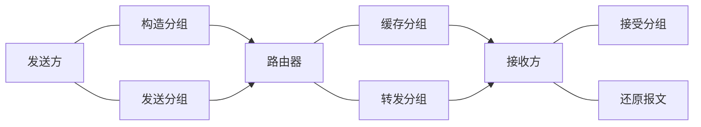

# Chapter 1 OVERVIEW

<!-- TOC -->

- [因特网概述](#因特网概述)
  - [网络、互联网、因特网](#网络互联网因特网)
  - [因特网发展的三个阶段](#因特网发展的三个阶段)
  - [因特网服务提供者（Internet Service Provider，ISP）](#因特网服务提供者internet-service-providerisp)
  - [因特网已发展成为**基于ISP的多层次结构的互连网络**](#因特网已发展成为基于isp的多层次结构的互连网络)
  - [因特网的**标准化**工作](#因特网的标准化工作)
  - [制定因特网正式标准的四个阶段](#制定因特网正式标准的四个阶段)
  - [因特网的管理机构](#因特网的管理机构)
  - [因特网的组成：边缘部分 + 核心部分](#因特网的组成边缘部分--核心部分)
- [电路交换、分组交换和报文交换](#电路交换分组交换和报文交换)
  - [电路交换](#电路交换)
  - [分组交换](#分组交换)
  - [报文交换](#报文交换)
  - [三种交换方式的对比](#三种交换方式的对比)
- [计算机网络的定义和分类](#计算机网络的定义和分类)
  - [计算机网络的定义](#计算机网络的定义)
    - [早期的简单定义](#早期的简单定义)
    - [现阶段的一个较好定义](#现阶段的一个较好定义)
  - [计算机网络的分类](#计算机网络的分类)
    - [交换方式](#交换方式)
    - [使用者](#使用者)
    - [传输介质](#传输介质)
    - [覆盖范围](#覆盖范围)
    - [拓扑结构](#拓扑结构)
- [计算机网络的性能指标](#计算机网络的性能指标)
  - [速率](#速率)
  - [带宽](#带宽)
  - [吞吐量](#吞吐量)
  - [时延](#时延)
    - [发送时延](#发送时延)
    - [传播时延](#传播时延)
    - [排队时延](#排队时延)
    - [处理时延](#处理时延)
  - [时延带宽积](#时延带宽积)
  - [往返时间（RTT）](#往返时间rtt)
  - [利用率](#利用率)
    - [链路利用率](#链路利用率)
    - [网络利用率](#网络利用率)
  - [丢包率](#丢包率)
- [计算机网络的体系结构](#计算机网络的体系结构)
  - [常见的三种计算机网络体系结构](#常见的三种计算机网络体系结构)
  - [分层的必要性](#分层的必要性)
    - [物理层](#物理层)
    - [数据链路层](#数据链路层)
    - [网络层](#网络层)
    - [运输层](#运输层)
    - [应用层](#应用层)
  - [分层思想举例](#分层思想举例)
  - [专用术语](#专用术语)
    - [实体](#实体)
      - [对等实体](#对等实体)
    - [协议](#协议)
    - [服务](#服务)

<!-- /TOC -->

## 因特网概述 

### 网络、互联网、因特网

- 网络（Network）：结点（Node） + 链路（Link）
- 互联网（互连网）：网络的网络（Network of Networks），可以通过路由器互连起来
- 因特网（Internet）：**当今世界上最大的互联网**

|     internet     | 对比 |   Internet   |
| :--------------: | :--: | :----------: |
|     通用名词     |      |   专用名词   |
| 互连网（互联网） |      |    因特网    |
|   任意通信协议   |      | TCP/IP协议族 |

### 因特网发展的三个阶段

* 第一个分组交换网：ARPANET，1969
* 因特网诞生时间：1983年

### 因特网服务提供者（Internet Service Provider，ISP）

### 因特网已发展成为**基于ISP的多层次结构的互连网络**

### 因特网的**标准化**工作

-   特点：**面向公众**，其任何一个建议标准在成为因特网标准之前都以 **RFC** 技术文档的形式在因特网上发表
    -   **RFC**（**Request For Comments**）的意思是“**请求评论**”。任何人都可以从因特网上免费下载**RFC**文档（**http://www.ietf.org/rfc.html**），并随时对某个 **RFC** 文档发表意见和建议。

### 制定因特网正式标准的四个阶段

### 因特网的管理机构

### 因特网的组成：边缘部分 + 核心部分

-   边缘：主机，用户直接使用，用于通信和资源共享
-   核心：大量网络 + 路由器，为边缘部分提供服务

## 电路交换、分组交换和报文交换 

### 电路交换

-   方式：电话交换机接通电话线
-   step
    -   建立连接（分配通信资源）
    -   通话（一直占用通信资源）
    -   释放连接（归还通信资源）
-   线路的**传输效率低**

### 分组交换

| 优点                                                         | 缺点                                                         |
| :----------------------------------------------------------- | :----------------------------------------------------------- |
| 没有建立连接和释放连接的过程。                               | 分组首部带来了额外的传输开销。                               |
| 分组传输过程中逐段占用通信链路，有较高的通信线路利用率。     | 交换节点存储转发分组会造成一定的时延。                       |
| 交换节点可以为每一个分组独立选择转发路由，使得网络有很好的生存性。 | 无法确保通信时端到端通信资源全部可用，在通信量较大时可能造成网络拥塞。 |
| 有利于差错控制，具有更好的灵活性                             | 分组可能会出现失序和丢失等问题                               |

### 报文交换

-   报文交换是分组交换的前身
-   方式：报文被整个地发送、整体接收完成后才能转发
-   缺点：引起转发时延、需要较大存储缓存空间

### 三种交换方式的对比

-   报文交换和分组交换都不需要建立连接，传送突发数据时可以**提高通信线路利用率**

## 计算机网络的定义和分类

### 计算机网络的定义

-   没有精确和统一的定义 

#### 早期的简单定义

​		**互联**、**自治**的**计算机集合**

#### 现阶段的一个较好定义

​		计算机网络主要是由一些**通用的、可编程的硬件互连而成**的

-   这些硬件

    -   **并非专门用来实现某一特定目的（例如，传送数据或视频信号）**

    -   而是能够**用来传送多种不同类型的数据，** **并能支持广泛的和日益增长的应用。**

### 计算机网络的分类

#### 交换方式

​		电路交换、报文交换、分组交换

#### 使用者

​		公用网（因特网）、专用网（军队、铁路、电力、银行）

#### 传输介质

​		有线网络、无线网络

#### 覆盖范围

​		WAN、MAN、LAN、PAN

#### 拓扑结构

​		总线形、星形、环形、网状形

## 计算机网络的性能指标

### 速率

数据的传输速率，也称数据率/比特率

### 带宽

**数据传送速率 =  min [主机接口速率，线路带宽，交换机或路由器的接口速率]** 

### 吞吐量

单位时间内通过某个网络或接口的实际数据量
- 常被用于对实际网络的测量，以便获知到底有多少数据量通过了网络。
- 受网络带宽的限制

### 时延
指数据从网络的一端传送到另一端所耗费的时间，也称为延迟或迟延。
- 数据构成：一个或多个 分组、甚至是一个比特
#### 发送时延
$$
发送时延 = \frac{分组长度(b)}{发送速率(b/s)}
$$

$$
发送速率 = min [ 主机接口速率，线路带宽，交换机或路由器的接口速率 ]
$$

#### 传播时延

$$
传播时延 = \frac{信道长度(m)}{信号传播速率(m/s)}
$$

|   介质   |      速率      |
| :------: | :------------: |
| 自由空间 | 3.0 × 10^8 m/s |
|  铜 线   | 2.3 × 10^8 m/s |
|  光 纤   | 2.0 × 10^8 m/s |

#### 排队时延

​		不方便计算、不考虑

#### 处理时延

​		不方便计算、不考虑

### 时延带宽积

传播时延和带宽的乘积，也称为以比特为单位的链路长度

### 往返时间（RTT）
指从发送端发送数据分组开始，到发送端收到接收端发 来的相应确认分组为止，总共耗费的时间。

### 利用率
#### 链路利用率
指某条链路有百分之 几的时间是被利用的（即有数据通过）。
- 当某链路的利用率增大时，该链路引起的时延就会迅速增加。
#### 网络利用率
指网络中所有链路的 链路利用率的加权平均。
- 在网络通信量不断增大时，分组在交换节点 （路由器或交换机）中的排队时延会随之增大，因此网络引起的时延就会增大。

### 丢包率
是指在一定的时间范围内，传输过程中**丢失的分组数量与总分组数量的比率**。
- 分类：接口丢包率、结点丢包率、链路丢包率、路径丢包率、网络丢包率
- 分组丢失主要有以下两种情况：
	- 分组在传输过程中出现**误码**，被传输路径中的**节点交换机**（例如路由器）或**目的主机**检测出误码而**丢弃**。
	- 节点交换机根据**丢弃策略**主动丢弃分组。
## 计算机网络的体系结构

### 常见的三种计算机网络体系结构

​		OSI参考模型、TCP/IP参考模型、原理参考模型

### 分层的必要性
- 计算机网络是个非常复杂的系统
- “分层”可将庞大复杂的问题转化为若干较小的局部问题

#### 物理层
- 解决使用何种信号来表示比特0和1的问题
    - 采用什么传输媒体（介质）
    - 采用什么物理接口
    - 采用什么信号表示比特0和1

#### 数据链路层
- 解决数据包在一个网络或一段链路上传输的问题
    - 标识网络中各主机（主机编址，例如MAC地址）
    - 从比特流中区分出地址和数据（数据封装格式）
    - 协调各主机争用总线（媒体接入控制）
    - 以太网交换机的实现（自学习和转发帧）
    - 检测数据是否误码（差错检测）
    - 出现传输差错如何处理（可靠传输和不可靠传输）
    - 接收方控制发送方注入网络的数据量（流量控制）

#### 网络层
- 解决数据包在多个网络之间传输和路由的问题
	- 标识网络和网络中的各主机（网络和主机共同编址，例如IP地址）
	- 路由器转发分组（路由选择协议、路由表和转发表）

#### 运输层
- 解决进程之间基于网络的通信问题
	- 进程之间基于网络的通信（进程的标识，例如端口号）
	- 出现传输差错如何处理（可靠传输和不可靠传输）

#### 应用层
- 解决通过应用进程的交互来实现特定网络应用的问题
	- 通过应用进程间的交互来完成特定的网络应用
	- 进行会话管理和数据表示

### 分层思想举例

### 专用术语

#### 实体
指任何可发送或接收信息的硬件或软件进程
##### 对等实体
指通信双方相同层次中的实体。

#### 协议
是控制两个对等实体在**“水平方向”** 进行“**逻辑通信**”的**规则**的集合。
- 三要素
	- 语法：定义所交换信息的格式
	- 语义：定义通信双方所要完成的操作
	- 同步：定义通信双方的时序关系

#### 服务
- 在协议的控制下，两个对等实体在水平方向的逻辑通信使得本层能够向上一层提供服务。
- 要实现本层协议，还需要使用下面一层所提供的服务
- 协议是“水平”的，而服务是“垂直”的。 
- 实体看得见下层提供的服务，但并不知道实现该服务的具体协议。
- 下层的协议对上层的实体是“透明”的。
- 服务访问点SAP
	- 在同一系统中相邻两层的实体交换信息的逻辑接口，用于区分不同的服务类型。
	- 帧的“类型”字段、IP数据报的“协议”字段，TCP报文段或UDP用户数据报的“端口号”字段都是SAP。
- 服务原语
	- 上层要使用下层所提供的服务时通过与下层交换的一些命令
- 协议数据单元（Protocol Data Unit，PDU）
	- **对等层次之间**传送的数据包
- 服务数据单元（Service Data Unit，SDU）
  - 同一系统内**层与层**之间交换的数据包

