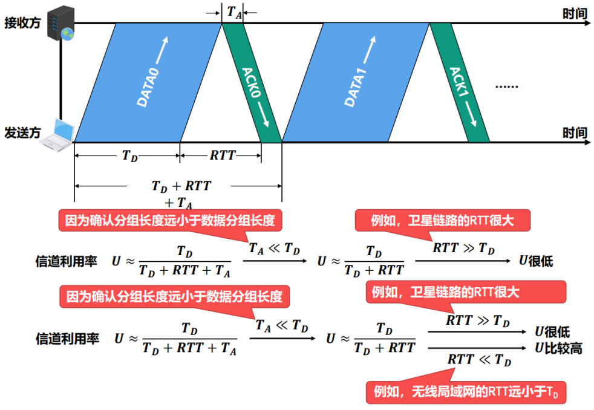
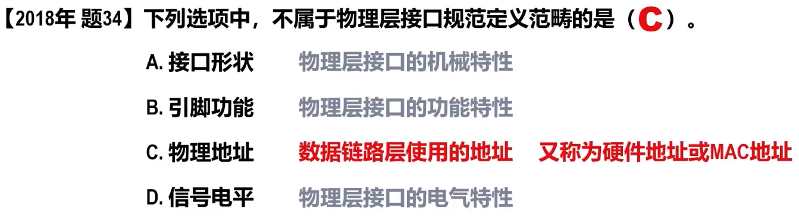

# chapter 3 data link layer

## 数据链路层概述

### 数据链路层在网络体系结构中所处的地位

### 链路、数据链路和帧

#### 链路（Link）
- 指从一个节点到**相邻节点**的一段物理线路（有线或无线），而**中间没有任何其他的交换节点。**

#### 数据链路（Data Link）
- 数据链路是基于链路的。
- 当在一条链路上传送数据时，除需要链路本身，还需要一些**必要的通信协议**来控制这些数据的传输，把实现这些协议的硬件和软件加到链路上，就构成了数据链路。
- 计算机中的网络适配器（俗称**网卡**）和其相应的**软件驱动程序**就实现了这些协议。
- 一般的网络适配器都包含了物理层和数据链路层这两层的功能。

#### 帧（Frame）
- 是数据链路层**对等实体之间**在水平方向进行逻辑通信的**协议数据单元PDU。**

## 数据链路层的三个重要问题

### 封装成帧和透明传输
#### 封装成帧

-   是指数据链路层给上层交付下来的协议数据单元PDU添加一个首部和一个尾部，使之成为帧。
	-   帧的首部和尾部中包含有一些重要的控制信息。
	-   帧首部和尾部的作用之一就是帧定界。
-   帧定界：接收端根据帧首部和帧尾部的标志字段，就可以从收到的比特流中识别出帧的开始和结束
-   
  - 并不是每一种数据链路层协议的帧都包含有帧定界标志。
      - 

- 为了提高数据链路层传输帧的效率，应当使帧的数据载荷的长度尽可能地大于首部和尾部的长度。
-   考虑到对缓存空间的需求以及差错控制等诸多因素，每一种数据链路层协议都规定了帧的数据载荷的长度上限，即最大传送单元（Maximum Transfer Unit，MTU）。
  -   
  -   例如，以太网的MTU为1500个字节。

#### 透明传输

-   透明传输：数据链路层对上层交付下来的协议数据单元PDU没有任何限制，就好像数据链路层不存在 一样。

##### 字节填充

- 插入转义字符、帧定界符

##### 比特填充

-   如每遇到5个连续的比特1，就再其后面插入一个比特0（HDLC协议）

### 差错检测

### 误码的相关概念
- 比特差错
	- 比特在传输过程中：比特1可能变成比特0；比特0可能变成比特1。
- 误码率（Bit Error Rate，BER）：传输错误的比特数量占所传输比特总数的比率
	- 提高链路的信噪比，可以降低误码率。
	- 在实际的通信链路上，不可能使误码率下降为零。

- 使用差错检测技术来检测数据在传输过程中是否产生了比特差错，是数据链路层所要解决的重要问题之一。
    - 帧在传输的过程中可能出现误码。
    - 接收方根据发送方添加在帧尾部中的检错码，可以检测出帧是否出现了误码。（采用与发送方相同的检错技术）
    - 帧检验序列（FCS）：帧尾部中用来存放检错码的字段

### 奇偶校验

- 奇校验是在待发送的数据后面**添加1个校验位**，使得添加该校验位后的整个数据中**比特1的个数为奇数。**
	- 
- 偶校验是在待发送的数据后面**添加1个校验位**，使得添加该校验位后的整个数据中**比特1的个数为偶数。**
    - 

-   奇数误码可检出，偶数误码会漏检。
-   在实际使用时，奇偶校验又可分为垂直奇偶校验、水平奇偶校验以及水平垂直奇偶校验。

### 循环冗余校验

- 数据链路层广泛使用漏检率极低的循环冗余校验（Cyclic Redundancy Check，CRC）检错技术。

#### CPC基本思想
- 收发双方约定好一个生成多项式G(X)。
- 发送方基于待发送的数据和生成多项式G(X)，计算出差错检测码（冗余码），将冗余码添加到待发送数据的后面一起传输。
- 接收方收到数据和冗余码后，通过生成多项式G(X)来计算收到的数据和冗余码是否产生了误码。

#### 发送方CRC操作

#### 接收方CRC操作

- 

#### 生成多项式

-   举例
	-   

-   常用的生成多项式
	-   

#### CRC举例

-   发送方

-   接收方

#### 注意

-   奇偶校验、循环冗余校验等差错检测技术，只能检测出传输过程中出现了差错，但并**不能定位错误**，因此**无法纠正错误**。
-   要想纠正传输中的差错，可以使用冗余信息更多的**纠错码**（例如海明码）进行**前向纠错**。但纠错码的**开销比较大，在计算机网络中较少使用**。
-   在计算机网络中，通常采用我们后续课程中将要介绍的**检错重传方式来纠正传输中的差错**，**或者仅仅丢弃检测到差错的帧**，这取决于数据链路层向其上层提供的是可靠传输服务还是不可靠传输服务。
-   循环冗余校验CRC具有很好的检错能力（**漏检率极低**），虽然计算比较复杂，但非常**易于用硬件实现**，因此被广泛应用于数据链路层。

### 可靠传输

#### 可靠传输的相关基本概念

##### 不可靠传输
- 直接丢弃有误码的帧，其他什么也不做。
##### 可靠传输
- 通过某种机制实现，实现发送方发送什么，接收方最终都能正确收到。

- 有线链路的误码率比较低，并不要求数据链路层向其上层提供可靠传输服务。
- 无线链路易受干扰，误码率比较高，因此要求数据链路层必须向其上层提供可靠传输服务。

##### 传输差错
- 数据链路层及其下层
    - 误码（比特差错）
- 数据链路层的上层
    - 分组丢失
    - 分组失序
    - 分组重复

- 可靠传输服务并不局限于数据链路层，其他各层均可选择实现可靠传输。
- 可靠传输的实现比较复杂，开销比较大，是否使用可靠传输取决于应用需求。

#### 停止-等待协议（Stop-and-Wait，SW）

##### 实现原理

- 确认、否认和重传
- 超时重传
	- 使用超时重传机制后，就可以不使用否认机制了，这样可使协议实现起来更加简单。但是，如果点对点链路的误码率较高，使用否认机制可以使发送方在超时计时器超时前就尽快重传。
	- 超时重传时间（Retransmission Time-Out，RTO）：一般将RTO设置为略大于收发双方的平均往返时间RTT
		- 在数据链路层，点对点的往返时间RTT比较固定，RTO就比较好设定。
		- 在运输层，由于端到端往返时间非常不确定，设置合适的超时重传时间RTO有时并不容易。
- 分组编号（数据分组+确认分组）
	- 只需1个比特编序号即可，即序号0和序号1。
	- 数据链路层一般不会出现确认分组迟到的情况，因此在数据链路层实现停止-等待协议可以不用给确认分组编号。
- 停止-等待协议属于自动请求重传（Automatic Repeat reQuest，ARQ）协议。即重传的请求是发送方自动进行的，而不是接收方请求发送方重传某个误码的数据分组。

##### 信道利用率

-   若出现超时重传，对于传送有用的数据信息来说，信道利用率还要降低。
-   在往返时间RTT相对较大的情况下，为了提高信道利用率，收发双方不适合采用停止-等待协议，而可以选择使用回退N帧（GBN）协议或选择重传（SR）协议。

#### 回退N帧协议（Go-back-N，GBN）

#### 选择重传协议（Selective Repeat，SR）

## 点对点协议

### 点对点协议PPP概述
- 点对点协议（Point-to-Point Protocol，PPP）是目前使用最广泛的点对点数据链路层协议。
- 点对点协议PPP是因特网工程任务组（Internet Engineering Task Force，IETF）于1992年制定的。经过多次 修订，目前PPP已成为因特网的正式标准[RFC1661，RFC1662]。
- 应用
	- 用户接入因特网，用户计算机与ISP通信。
	- 广泛应用于广域网路由器之间的专用线路。
- 从网络体系结构的角度看点对点协议PPP的组成

### PPP的帧格式

### PPP帧的透明传输

-   面向字节的异步链路使用字节填充来实现透明传输[RFC1662]

-   面向比特的同步链路使用零比特填充来实现透明传输

### PPP帧的差错检测

### PPP的工作状态

-   以用户主机拨号接入因特网服务提供者ISP的拨号服务器的过程为例

## 共享式以太网
### 概述
- 以太网（Ethernet）以曾经被假想的电磁波传播介质——以太（Ether）来命名。
- 以太网最初采用无源电缆（不包含电源线）作为共享总线来传输帧，属于基带总线局域网，传输速率为2.94Mb/s。
- 发展
	- 1975 以太网诞生
	- 1976 以太网里程碑论文
	- 1979 3Com公司成立
	- 1980 以太网标准V1
	- 1982 以太网标准V2
	- 1983 IEEE以太网标准
- 以太网目前已经从传统的共享式以太网发展到交换式以太网，传输速率已经从10Mb/s提高到100Mb/s、1Gb/s甚至10Gb/s。

### 网络适配器和MAC地址

#### 网络适配器

- **网络适配器**（Adapter）（一般简称为“网卡”）：将计算机连接到以太网。

-   在计算机内部，**网卡与CPU**之间的通信，一般是通过计算机主板上的I/O总线以**并行传输**方式进行
-   **网卡与外部以太网**（局域网）之间的通信，一般是通过传输媒体（同轴电缆、双绞线电缆、光纤）以**串行方式**进行的。
-   网卡除要**实现物理层和数据链路层功能**，其另外一个重要功能就是要进行**并行传输和串行传输的转换**。由于网络的传输速率和计算机内部总线上的传输速率并不相同，因此在网卡的核心芯片中都会包含**用于缓存数据的存储器**。
-   在确保网卡硬件正确的情况下，为了使网卡正常工作，还必须要在计算机的操作系统中为网卡安装相应的**设备驱动程序**。驱动程序**负责驱动网卡发送和接收帧**。

#### MAC地址
##### 概念
- 当多个主机连接在同一个广播信道上，要想实现两个主机之间的通信，则每个主机都必须有一个唯一的标识，即一个数据链路层地址。
-   MAC地址：用于媒体接入控制（Medium Access Control，MAC）；每个主机发送的帧的首部中，携带有发送主机（源主机）和接收主机（目的主机）的数据链路层地址。

-   MAC地址一般被固化在网卡的电可擦可编程只读存储器EEPROM中，因此MAC地址也被称为硬件地址。
-   MAC地址有时也被称为物理地址。

- 普通用户计算机中往往会包含两块网卡
	- 用于接入有线局域网的以太网卡
	- 用于接入无线局域网的Wi-Fi网卡
- 每块网卡都有一个全球唯一的MAC地址。
- MAC地址是对网络上各接口的唯一标识， 而不是对网络上各设备的唯一标识。

##### IEEE 802局域网的MAC地址格式

##### IEEE 802局域网的MAC地址发送顺序

##### 单播MAC地址举例

##### 广播MAC地址举例

##### 多播MAC地址举例

- 网卡从网络上每收到一个帧，就检查帧首部中的目的MAC地址，按以下情况处理：
	- （1）如果目的MAC地址是广播地址（FF-FF-FF-FF-FF-FF），则接受该帧。
	- （2）如果目的MAC地址与网卡上固化的全球单播MAC地址相同，则接受该帧。
	- （3）如果目的MAC地址是网卡支持的多播地址，则接受该帧。
	- （4）除上述（1）、（2）和（3）情况外，丢弃该帧。
- 网卡还可被设置为一种特殊的工作方式：混杂方式（Promiscuous Mode）。工作在混杂方式的网卡，只要收到共享媒体上传来的帧就会收下，而不管帧的目的MAC地址是什么。
	- 对于网络维护和管理人员，这种方式可以监视和分析局域网上的流量，以便找出提高网络性能的具体措施。
	- 嗅探器（Sniffer）就是一种工作在混杂方式的网卡，再配合相应的工具软件（WireShark），就可以作为一种非常有用的网络工具来学习和分析网络。
	- 混杂方式就像一把“双刃剑”，黑客常利用这种方式非法获取网络用户的口令。

全球单播MAC地址就如同身份证上的身份证号码，具有唯一性，它往往与用户个人信息绑定在一起。因此，用户应尽量**确保自己拥有的全球单播MAC地址不被泄露**。

为了避免用户设备连接Wi-Fi热点时MAC地址泄露的安全问题，目前大多数移动设备都已经采用了
**随机MAC地址技术**。

### CSMA/CD协议

#### CSMA/CD协议的基本原理

- 为了解决各站点争用总线的问题，共享总线以太网使用了一种专用协议CSMA/CD，它是载波监听多址接入/碰撞检测（Carrier Sense Multiple Access Collision Detection）的英文缩写词。

-   载波监听检测到总线空闲，但总线并不一定空闲。
-   使用CSMA/CD协议的共享总线以太网上的各站点，只是尽量避免碰撞并在出现碰撞时做出退避后重发的处理，但**不能完全避免碰撞**。
-   在使用CSMA/CD协议时，由于正在发送帧的站点必须“边发送帧边检测碰撞”，因此站点不可能同时进行发送和接收，也就是不可能进行全双工通信，而**只能进行半双工通信（双向交替通信）**。

##### 多址接入 MA

- 多个站点连接在一条总线上，竞争使用总线。

##### 载波监听 CS

- 每个站点在发送帧之前，先要检测一下总线上是否有其他站点在发送帧（“先听后说”）

##### 碰撞检测CD

-   每个正在发送帧的站点边发送 边检测碰撞（“边说边听”）
	-   一旦冲突，立即停说，等待时机，重新再说

-   强化碰撞
	-   发送帧的站点一旦检测到碰撞，除了立即停止发送帧外，还要**再继续发送32比特或48比特的人为干扰信号（Jamming Signal）**，以便**有足够多的碰撞信号使所有站点都能检测出碰撞**。

#### 共享式以太网的争用期

- 共享总线以太网的端到端往返时间**2τ被称为争用期（Contention Period）或碰撞窗口（Collision Window）**
- 站点从发送帧开始，最多经过时长2τ（即δ→ 0）就可检测出所发送的帧是否遭遇了碰撞。

- 从争用期的概念可以看出，共享总线以太网上的每一个站点从发送帧开始，到之后的一小段时间内，都有可能遭遇碰撞，而这一小段时间的长短是不确定的，它取决于另一个发送帧的站点与本站点的距离，但不会超过总线的端到端往返传播时延，即一个争用期2τ 。
	- 总线的长度越长（单程端到端传播时延越大），网络中站点数量越多，发生碰撞的概率就越大。
	- 共享以太网的总线长度不能太长，接入的站点数量也不能太多。

#### 共享式以太网的最小帧长和最大帧长

-   最小帧长 = 数据传输速率 * 争用期 *2 τ*
    -   为了确保共享总线以太网上的每一个站点在发送完一个完整的帧之前，能够检测出是否产生了碰撞， 帧的发送时延就不能少于共享总线以太网端到端的往返时间，即一个争用期2τ 。
    -   对于10*mb/s*的共享总线以太网，其争用期2τ的值规定51.2*μs*，因此其最小帧长为512b，即64B。

-   最大帧长
    - 一般来说，帧的数据载荷的长度应远大于帧首部和尾部的总长度，这样可以提高帧的传输效率。

    
    - 然而，如果不限制数据载荷的长度上限，就可能使得帧的长度太长，这会带来一些问题。

#### 共享式以太网的退避算法

-   在使用CSMA/CD协议的共享总线以太网中，正在发送帧的站点一边发送帧一边检测碰撞，当检测到碰撞时就立即停止发送，**退避一段随机时间**后再重新发送。

##### 截断二进制指数退避
- 共享总线以太网中的各站点采用截断二进制指数退避（Truncated Binary Exponential Backoff）算法来选择退避的随机时间。

- 如果连续多次发送碰撞，就表明可能有较多的站点参与竞争信道。但使用上述退避算法**可使重传需要推迟的平均时间随重传次数而增大（即动态退避）**，因而**减小产生碰撞的概率。**
- **当重传达16次仍不能成功时**，就表明同时打算发送帧的站点太多，以至于连续产生碰撞，此时应**放弃重传**并向高层报告。

#### 共享式以太网的信道利用率

### 使用集线器的共享式以太网

#### 粗（->细）同轴电缆的共享总线以太网

- 若总线上的某个机械连接点接触不良或断开，则整个网络通信就不稳定或彻底断网。

#### 集线器
- 集线器（Hub）：
	- 使用大规模集成电路来替代总线、并且可靠性非常高的设备。
	- 站点连接到集线器的传输媒体也转而使用更便宜、更灵活的双绞线电缆。

-   特点
    -   物理拓扑是星型的，但在逻辑上仍然是一个总线网。总线上的各站点共享总线资源，使用的还是CSMA/CD协议。
    -   只工作在物理层，仅简单地转发比特，并不进行碰撞检测。碰撞检测的任务由各站点中的网卡负责。
    -   有少量的容错能力和网络管理功能
	    -   例如，若网络中某个站点的网卡出现了故障而不停地发送帧，集线器可以检测到这个问题，在内部断开与出故障网卡的连线，使整个以太网能正常工作。

#### 对比

#### 10BASE-T星型以太网

- EEE于1990年制定了10BASE-T星型以太网的标准802.3i，这种以太网是局域网发展史上的一座非常重要的里程碑，它为以太网在局域网中的统治地位奠定了牢固的基础。
- 10BASE-T以太网的通信距离较短，每个站点到集线器的距离不能超过100m。
- IEEE 802.3以太网还可使用光纤作为传输媒体，相应的标准为10BASE-F，“F”表示光纤。光纤主要用作集线器之间的远程连接。

### 在物理层扩展以太网

#### 扩展站点与集线器之间的距离

- 中两站点之间的距离太远会使传输的信号就会衰减到使CSMA/CD协议无法正常工作。
- 在早期广泛使用粗同轴电缆或细同轴电缆共享总线以太网时，为了提高网络的地理覆盖范围，常用的是工作在物理层的转发器。
- IEEE 802.3标准规定，两个网段可用一个转发器连接起来，任意两个站点之间最多可以经过三个网段。

- 在10BASE-T星型以太网中，可使用光纤和一对光纤调制解调器来扩展站点与集线器之间的距离。
	- 这种扩展方法比较简单，所需付出的代价是：为站点和集线器各增加一个用于电信号和光信号转换的光纤调制解调器，以及它们之间的一对通信光纤。

- 信号在光纤中的衰减和失真很小，因此使用这种方法可以很简单地将站点与集线器之间的距离扩展到1000以上。

-   在物理层扩展的共享式以太网仍然是一个碰撞域，不能连接太多的站点，否则可能会出现大量的碰撞，导致平均吞吐量太低。

#### 扩展共享式以太网的覆盖范围和站点数量

### 在数据链路层扩展以太网

#### 使用网桥在数据链路层扩展以太网

- 网桥（bridge）工作在数据链路层（包含其下的物理层），因此网桥具备属于数据链路层范畴的相关能力。
	- 网桥可以识别帧的结构。
	- 网桥可以根据帧首部中的目的MAC地址和网桥自身的帧转发表来转发或丢弃所收到的帧。

#### 网桥的主要结构和基本工作原理

#### 透明网桥的自学习和转发帧的流程

- 透明网桥（Transparent Bridge）通过自学习算法建立转发表。
	- “透明”，是指以太网中的各站点并不知道自己所发送的帧将会经过哪些网桥的转发，最终到达目的站点。也就是说，**以太网中的各网桥对于各站点而言是看不见的**。
	- 透明网桥的标准是IEEE 802.1D，它通过一种自学习算法**基于以太网中各站点间的相互通信**逐步建立起自己的转发表。

#### 透明网桥的生成树协议STP

-   为了提高以太网的可靠性，有时需要在两个以太网之间使用多个透明网桥来提供冗余链路。
    -   在增加冗余链路提高以太网可靠性的同时，却给网络引入了环路。
    -   网络中的广播帧将在环路中永久兜圈，造成广播帧充斥整个网络，网络资源被白白浪费，而网络中的主机之间无法正常通信！
-   **生成树协议（Spanning Tree Protocol，STP）**
	-   避免广播帧在环路中永久兜圈；可以在增加冗余链路提高网络可靠性的同时，又避免环路带来的问题。
	-   不管网桥之间连接成了怎样复杂的带环拓扑，网桥之间通过**交互网桥协议单元（Bridge Protocol DataUnit，BPDU）**，**找出原网络拓扑的一个连通子集（即生成树）**，在这个子集里整个连通的网络中**不存在环路**。
	-   当首次连接网桥或网络拓扑发生变化时（人为改变或出现故障），网桥都会**重新构造生成树，以确保网络的连通**。

## 交换式以太网

###  交换式以太网

### 以太网交换机

- 以太网交换机
	- 本质上就是一个多接口的网桥
	- 交换机自学习和转发帧的流程与网桥是相同的
	- 交换机也使用生成树协议STP，来产生能够连通全网但不产生环路的通信路径。
- 交换机的每个接口可以连接计算机，也可以连接集线器或另一个交换机。
	- 当交换机的接口与计算机或交换机连接时，可以工作在**全双工方式**，并能在**自身内部同时连通多对接口**，使每一对相互通信的计算机都能像独占传输媒体那样，无碰撞地传输数据，这样就**不需要使用CSMA/CD协议了**。
	- 当交换机的接口连接的是集线器时，该接口就只能使用CSMA/CD协议并只能工作在半双工方式。
	- 现在的交换机和计算机中的网卡都能自动识别上述两种情况，并自动切换到相应的工作方式。
	- 交换机一般都具有多种速率的接口，例如10Mb/s、100Mb/s、1Gb/s甚至10Gb/s的接口，大部分接口支持多速率自适应。

### 共享式以太网与交换式以太网的对比

-   集线器
    -   扩大了广播域
    -   扩大了碰撞域

-   交换机
    -   扩大了广播域
    -   隔离了碰撞域
-   交换式以太网的网络性能远高于共享式以太网，集线器早已被交换机取代。

## 以太网的MAC帧格式  

## 虚拟局域网

## 以太网的发展

## 802.11 无线局域网

## 题目

停止等待协议

回退N帧协议

选择重传协议

-   CDMA

-   争用期

-   最小帧长

-   共享式以太网的信道利用率

-   10BASET

-   以太网交换机

-   共享式以太网与交换式以太网的对比

