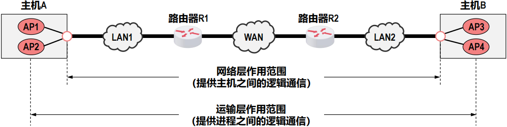
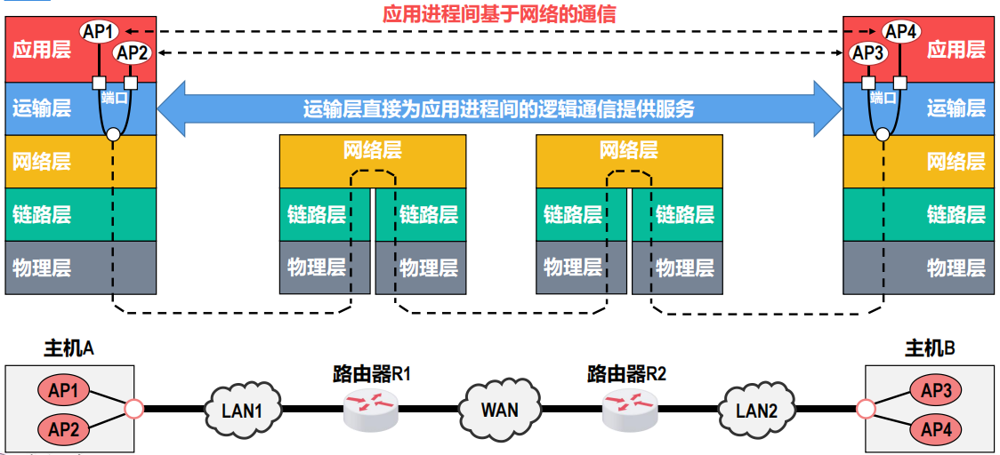
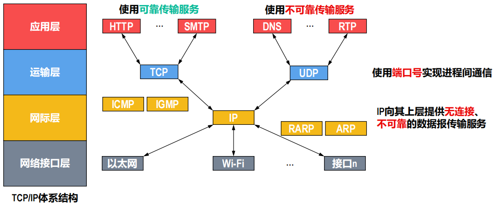
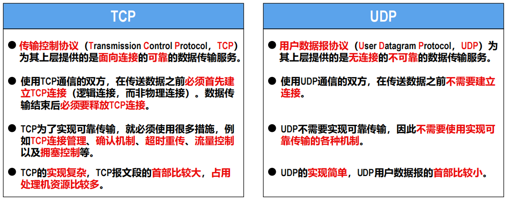
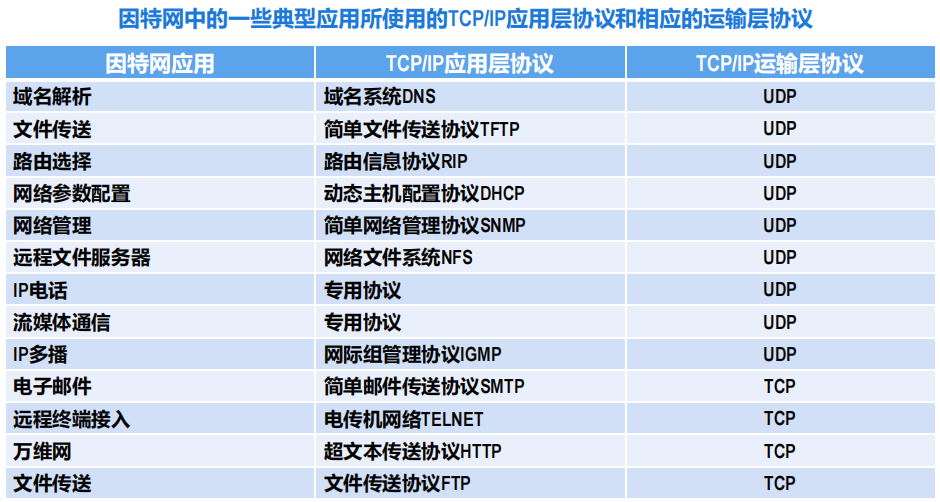
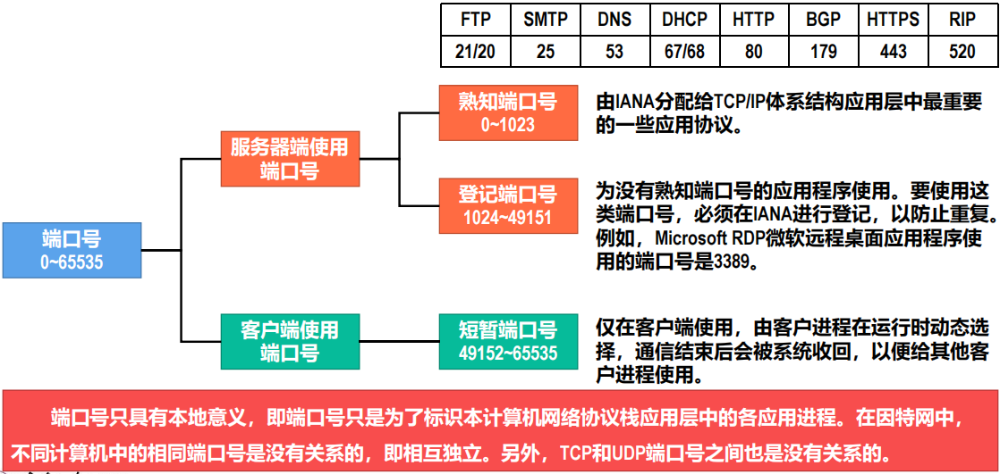
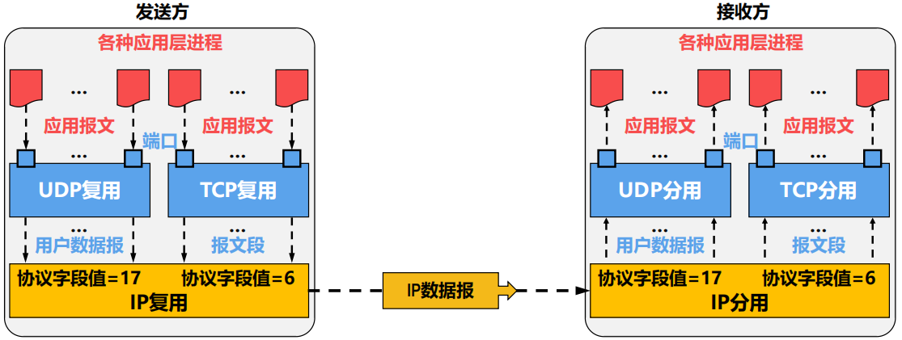
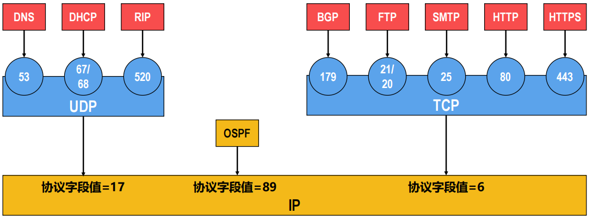
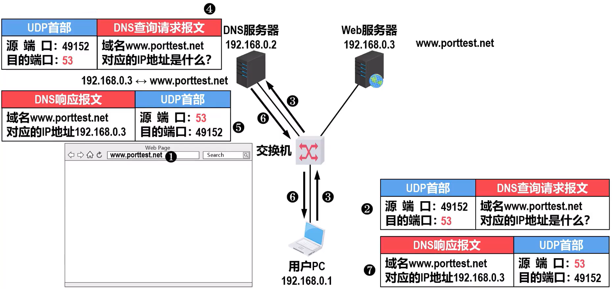
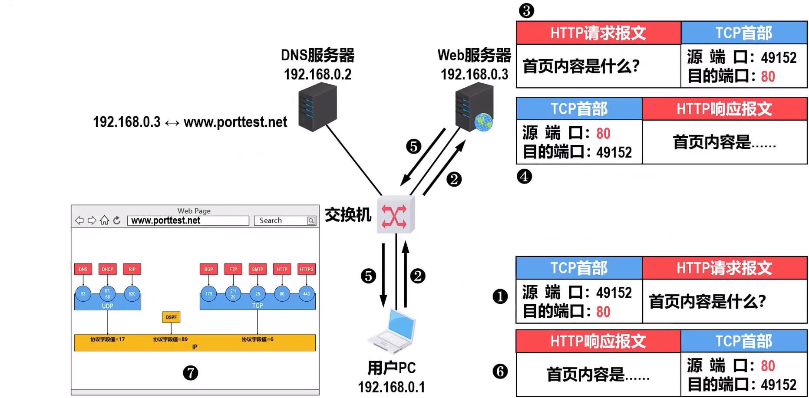

# Chapter 5 Transport layer

## 运输层概述

### 进程间基于网络的通信

- 计算机网络体系结构中的**物理层、数据链路层和网络层**，它们共同解决了将主机通过异构网络互联起来所面临的问题，实现了**主机到主机的通信**。
- 计算机网络中实际进行**通信的真正实体，是位于通信两端主机中的进程**。
- 运输层的主要任务：为运行在不同主机上的应用进程提供直接的逻辑通信服务
- 运输层协议又称为端到端协议。

-   运输层向应用层实体屏蔽了下面网络核心的细节（例如网络拓扑、所采用的路由选择协议等），它使应用进程看见的就好像是在两个运输层实体之间有一条端到端的逻辑通信信道。
-   根据应用需求的不同，因特网的运输层为应用层提供了两种不同的运输层协议，即面向连接的TC和无连接的UDP，这两种协议就是本章要讨论的主要内容。

### TCP/IP运输层中的两个重要协议

### 运输层端口号

-   运行在计算机上的进程是使用进程标识符（Process Identification，PID）来标识的。
	-   不同操作系统（Windows、Linux、MacOS）又使用不同格式的进程标识符。
	-   为了使运行不同操作系统的计算机的应用进程之间能够基于网络进行通信，就必须使用统一的方法对TCP/IP体系的应用进程进行标识。

- TCP/IP体系结构的运输层使用**端口号**来**标识和区分应用层的不同应用进程**。
- 端口号的**长度为16比特，取值范围是0~65535**。

### 发送方的复用和接收方的分用

#### TCP/IP体系结构应用层常用协议所使用的运输层协议和熟知端口号

-   **OSPF报文并不使用运输层的UDP或TCP进行封装，而是直接使用网际层的IP进行封装。**

### 运输层端口号应用举例

## UDP和TCP的对比

## 传输控制协议

